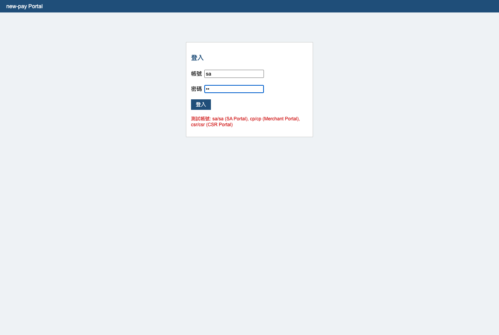
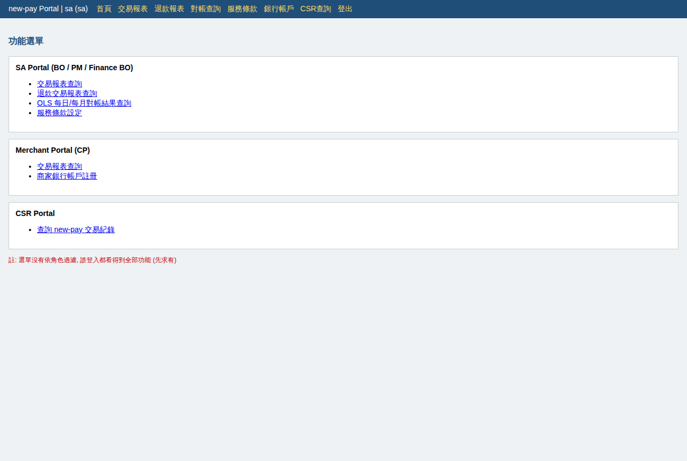
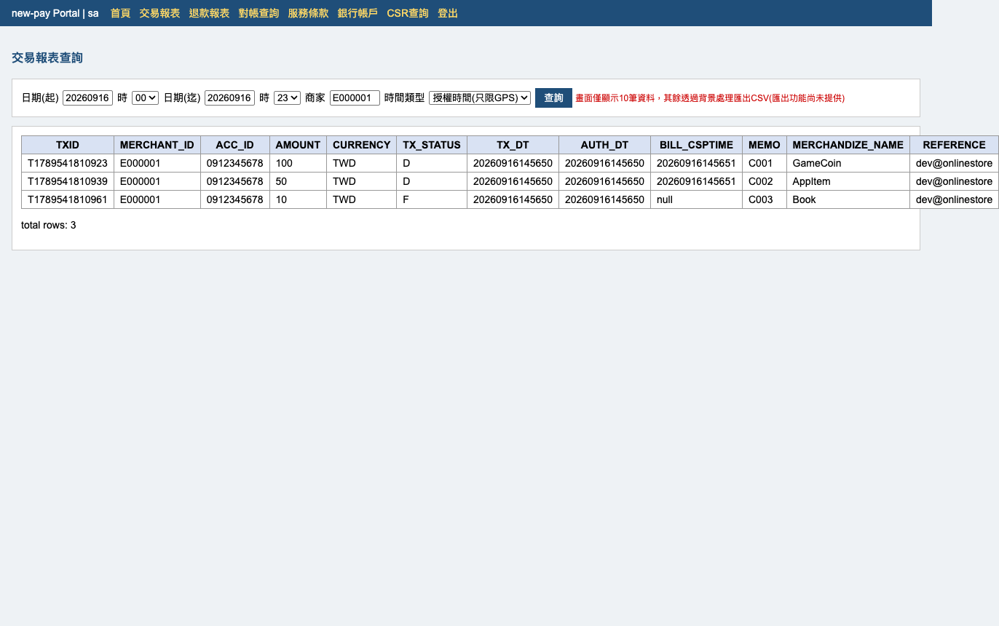
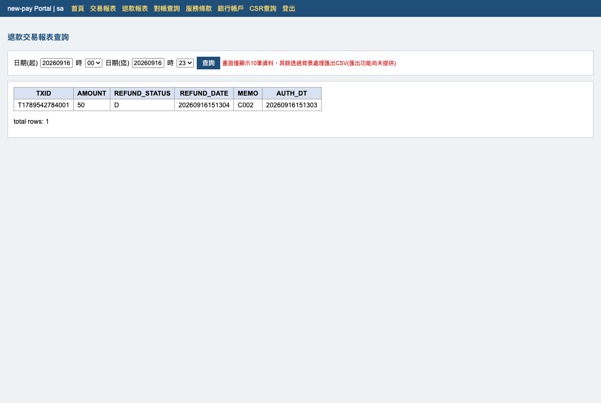
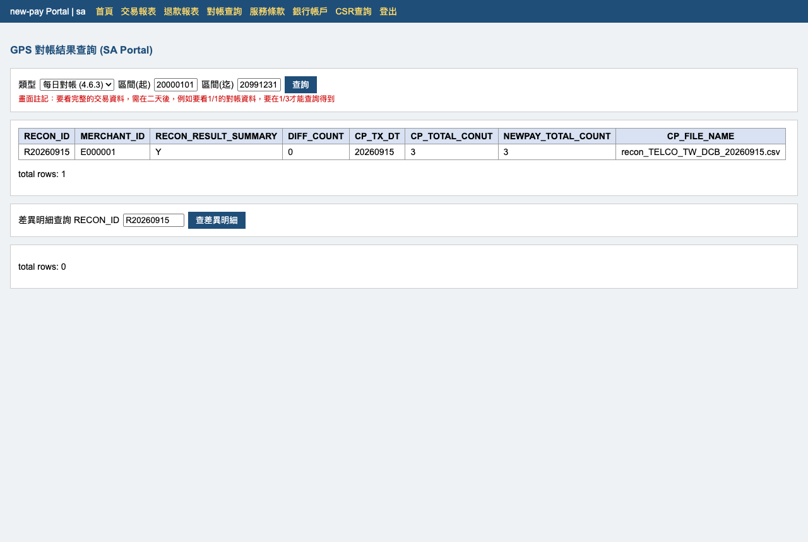
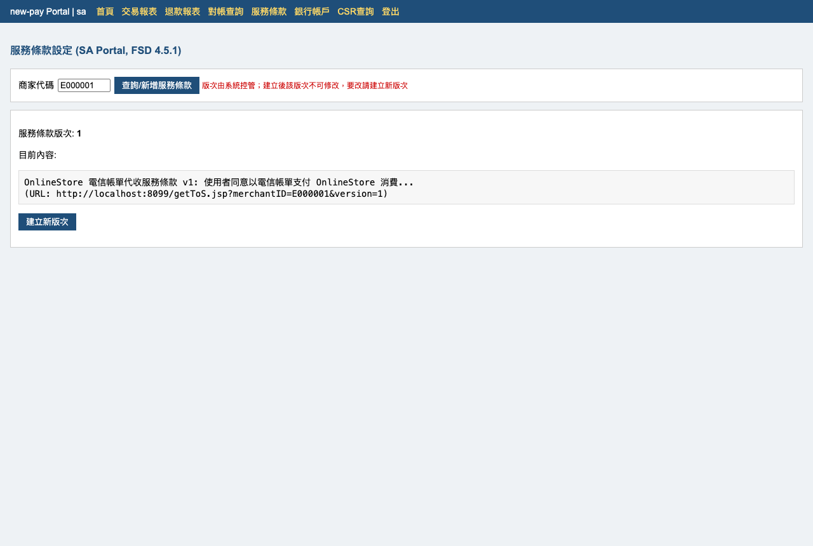
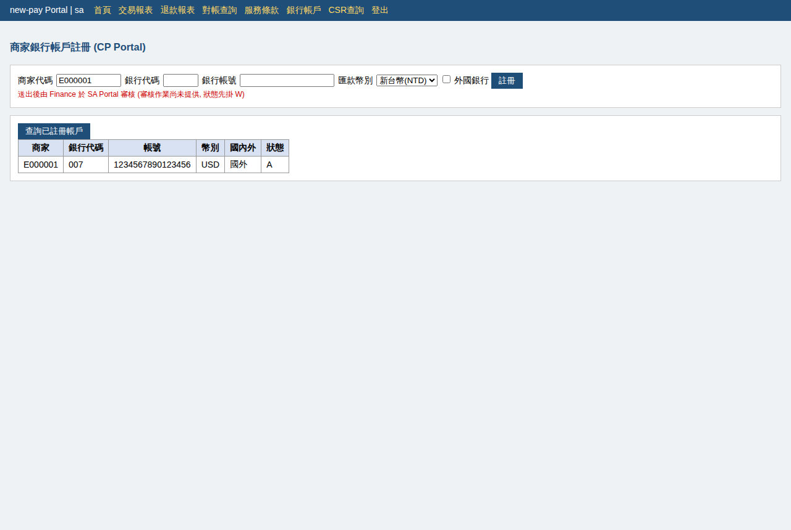
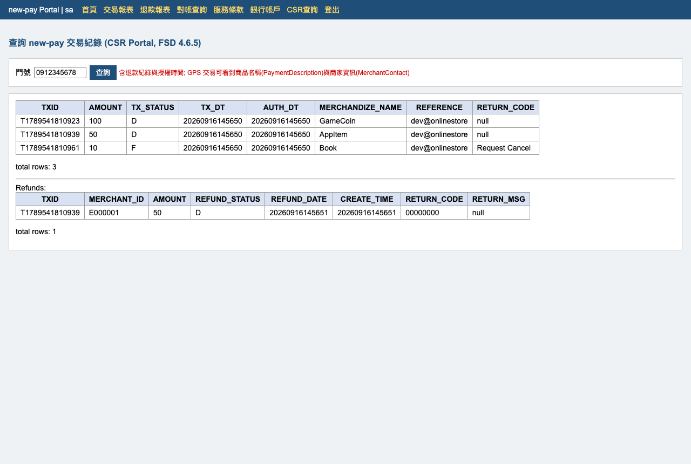

# new-pay OnlineStore(OLS) 遺留系統 Monorepo

依 `new-pay_OnlineStore_FSD.md` / `new-pay_OnlineStore_SD.md` 實作的電信帳單代收（DCB）系統。
**這是刻意保留技術債的 workshop 教材**：可以執行、功能符合規格書核心流程，但架構混亂、無任何測試，適合作為 AI 輔助重構的練習對象。技術債清單見 `TECH_DEBT_NOTES.md`。

## Monorepo 結構

```
payment-fubon-bank-workshop/
├── pom.xml          # parent (aggregator)
├── backend/         # 交易後端: SOAP API / 批次 / 對帳 / H2 DB (port 8099)
├── portal/          # SA/CP/CSR Portal: Thymeleaf + jQuery (port 8098)
├── demo.sh          # 後端端到端 demo 腳本
└── docs/screenshots/  # Portal 手動測試截圖
```

## 技術棧

| 模組 | 技術 |
|---|---|
| backend | JDK 8 + Spring Boot 2.7.18 + JdbcTemplate + H2（Oracle 模式，in-memory，重啟即重置） |
| portal | JDK 17 + Spring Boot 4.1.1 + Thymeleaf + HTML + jQuery 1.12.4 |

外部系統均為內建模擬：OLS SFTP → 本機 `backend/data/` 資料夾（略過 PGP）、OLS DCB API 與 CSP → fake endpoint / 寫死名單。

---

# 使用說明

## 1. 啟動

需要兩個終端機視窗（**務必在各模組目錄下啟動**，檔案路徑都是相對路徑寫死的）：

```bash
# 視窗一: 後端
cd backend
JAVA_HOME=~/.sdkman/candidates/java/8.0.482-zulu mvn spring-boot:run

# 視窗二: Portal
cd portal
JAVA_HOME=~/.sdkman/candidates/java/21.0.11-amzn mvn spring-boot:run
```

| 服務 | 位置 |
|---|---|
| 後端 API | http://localhost:8099 （8080 常被其他程序佔用，勿改回） |
| Portal | http://localhost:8098 |
| H2 Console | http://localhost:8099/h2-console （URL `jdbc:h2:mem:newpay`，帳號 `sa`，密碼空白） |

## 2. 造測試資料

Portal 的報表要有資料可看，先在 monorepo 根目錄跑一次後端 demo（會做完 Association → Auth → 批次請款/取消/退款 → 日/月對帳）：

```bash
cd <repo root>
./demo.sh
```

## 3. 登入 Portal

開 http://localhost:8098 ，測試帳號（帳號即角色）：

| 帳號/密碼 | 角色 |
|---|---|
| `sa` / `sa` | SA Portal（BO / PM / Finance BO） |
| `cp` / `cp` | Merchant Portal（CP 商家） |
| `csr` / `csr` | CSR Portal（客服） |



登入後為功能選單（注意：選單沒有依角色過濾——這是已知technical debt）：



## 4. 各功能操作

### 4.1 交易報表查詢（SA/CP，FSD 4.6.1）
選日期區間（可到小時 00~23）、商家、時間類型（交易時間 / 授權時間-只限OLS）後按「查詢」。畫面僅顯示 10 筆。



### 4.2 退款交易報表查詢（SA/CP，FSD 4.6.2）



### 4.3 OLS 對帳結果查詢（SA，FSD 4.6.3 / 4.6.4）
類型選「每日對帳」或「每月對帳」，輸入區間查詢；下方可用 RECON_ID（如 `R20260915`）查差異明細（對帳正常時明細為 0 筆）。



### 4.4 服務條款設定（SA，FSD 4.5.1）
輸入商家代碼按「查詢/新增服務條款」：無條款顯示空白表單（存檔）、已有條款顯示最新版（建立新版次）。版次由系統控管、建立後不可修改。



### 4.5 商家銀行帳戶註冊（CP，FSD 4.6.6）
支援 NTD/USD 幣別與外國銀行註記；送出後狀態掛 `W` 待 Finance 審核（4.6.7 審核作業尚未提供）。



### 4.6 CSR 交易查詢（CSR，FSD 4.6.5）
以門號查交易（含退款、授權時間、商品名稱 PaymentDescription、商家資訊 MerchantContact）。



## 5. 後端 API 快速測試（不經 Portal）

```bash
B=http://localhost:8099

# Association（模擬 Mpush 簡訊）
curl "$B/servlet/SMSPushMOOLS?msisdn=0912345678&content=DCB_ASSOCIATION:SUT123"

# getProvisioning / Auth（SOAP-like XML）
curl -X POST $B/soap/getProvisioning -H "Content-Type: text/xml" -d '<GetProvisioningRequest><OperatorUserToken>U0001</OperatorUserToken><BillingAgreementId>TELCO_TW</BillingAgreementId><UserLocale>ZH-TW</UserLocale><CorrelationId>P0001</CorrelationId></GetProvisioningRequest>'

# 產生批次檔並跑批次（Charge/Cancel/Refund）
curl "$B/fakeols/genRequestFile?type=Charge&correlationId=C001"
curl "$B/batch/run?job=all"

# 日對帳（&mismatch=true 可注入金額差異觸發告警）
curl "$B/fakeols/genReconFile"
curl "$B/batch/run?job=reconOLSDaily"
```

## 6. 測試資料（backend data.sql）

| 用戶 | MSISDN / OUT | 情境 |
|---|---|---|
| U0001 | 0912345678 | postpaid active，正常交易 |
| U0002 | 0922222222 | prepaid → isProvisioned=false |
| U0003 | 0933333333 | postpaid bar → provision true / Auth 回 ACCOUNT_ON_HOLD |
| U0004 | 0944444444 | Hybrid → 不可帳單付款 |
| U0005 | 0955555555 | 不在 MWP_USER、CSP 查得到 postpaid → auto provision |

商家：`E000001`（SDK API 密碼 `password1`）。Association 失敗情境：SUT 用 `BAD404` / `BAD403` / `BAD503` 開頭。

## 簡化與偏離規格處

- SOAP 用手刻 XML over HTTP 模擬（無 WSDL/namespace），欄位名稱依 FSD 敘述自訂
- Batch API 檔案格式為自訂簡化 CSV；PGP 加解密未實作（TODO 註記在程式裡）
- `MWP_OLS_REQ_LOG.FILE_NAME` 由 spec 的 20 放寬為 80（檔名放不下）
- 對帳檔多檔切分（-of-）只實作單檔路徑
- Portal 無真正權限控管、Finance 審核作業（4.6.7）未提供
