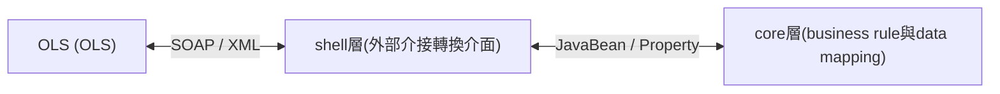
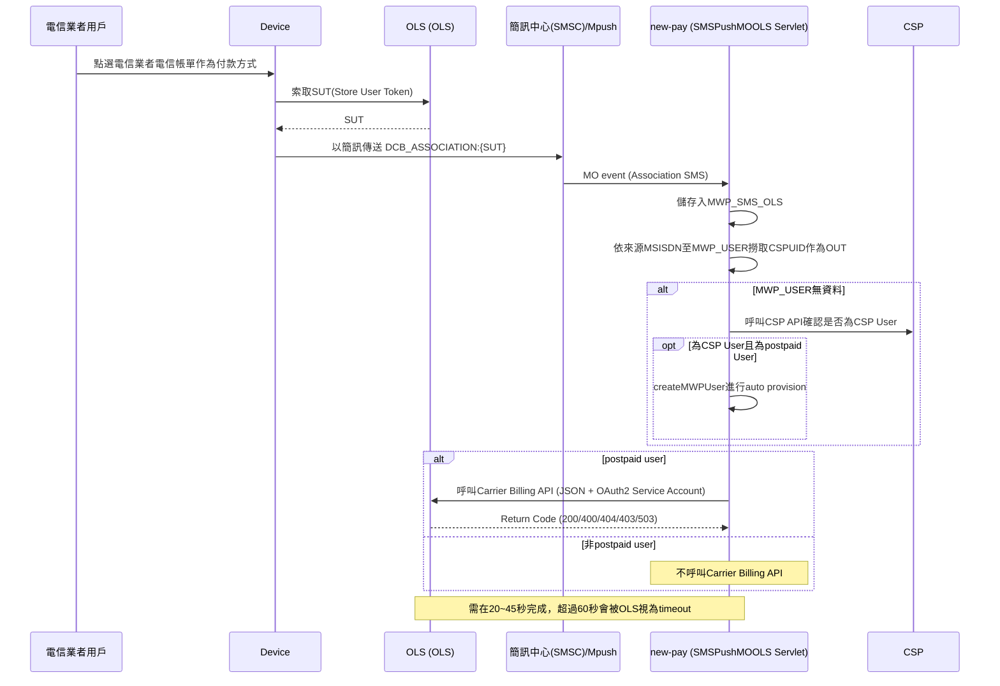
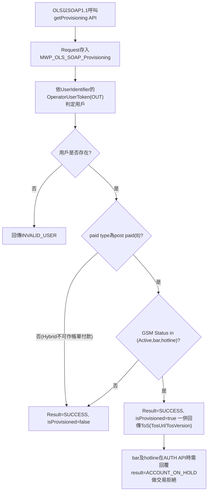
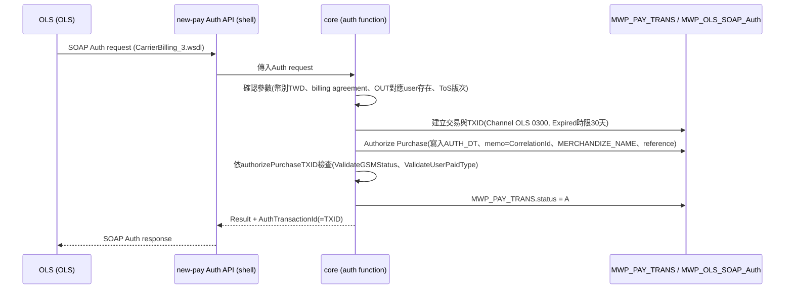
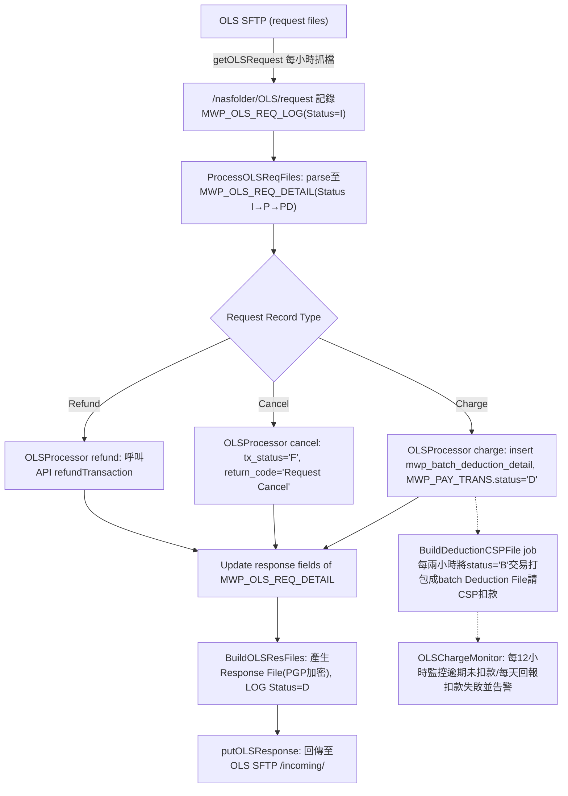
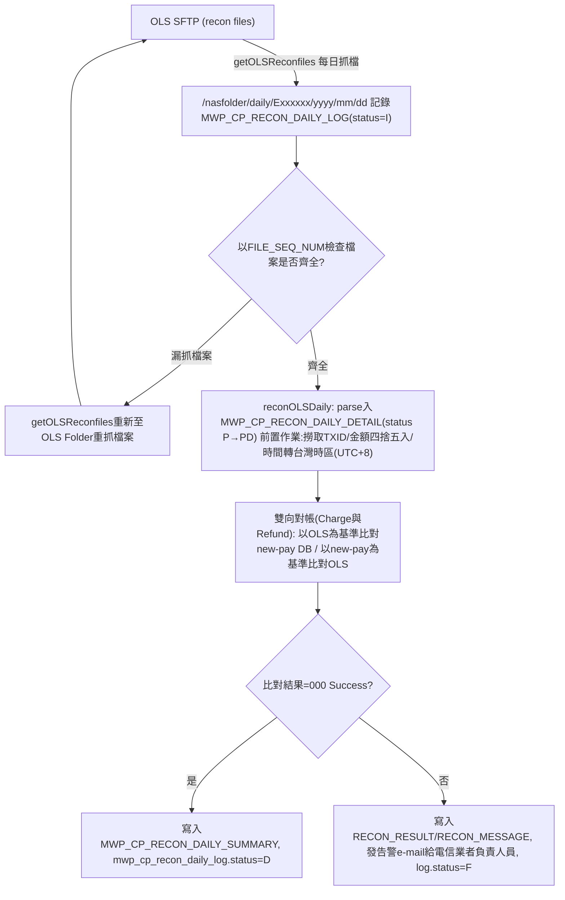
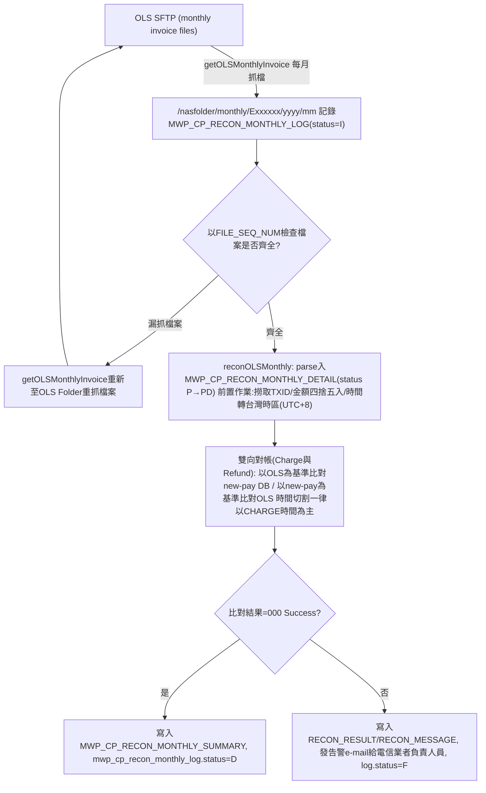

# new-pay OnlineStore — Functional Spec Document (FSD)

> 本文件由原始 Detail Design Spec（2013/03/03，作者：[人員A]）去識別化後拆分而成之「功能規格」部分。
> 註：原文件中的圖片無法自 .doc 檔轉出；文中的流程圖與循序圖已依內文文字以 mermaid 重建（非原始圖檔），其餘圖片（畫面截圖、Use Case 圖等）仍佚失。
> 去識別化代換：電信業者名稱→「電信業者 / Telco」、承包廠商名稱→「廠商 / Vendor」、人名→[人員A]~[人員E]、內部網域/email→telco.example.com、PGP 金鑰 ID→[KEYID-n]。

## SIGN-OFF

| | |
|---|---|
| 廠商 / Project manager | 電信業者 / Project Manager |
| 廠商 / Sponsor | 電信業者 / Sponsor |

## Revision History

| Revision Number | Revision Date | Summary of Changes | Changes Marker |
|---|---|---|---|
| 1 | 2013/04/03 | 日/月對帳rule調整->不需考慮日光節約時間、檔案遇到跨天/跨月對帳若不一致一律發alert(4.2.5.3、4.2.6.3) | [人員B] |
| 2 | 2013/04/03 | cancelOLSTransaction API design (4.4.6) | [人員B] |
| 3 | 2013/04/05 | DB Table naming 異動(4.8.1 & 4.8.13) | [人員B] |
| 4 | 2013/04/05 | Physical Architecture(2.2) | [人員C] |
| 5 | 2013/04/05 | Traffic Pattern(2.3) | [人員C] |
| 6 | 2013/04/10 | ToS服務條款功能修正(4.5.1) | [人員B] |
| 7 | 2013/04/11 | 日/月對帳parsing rule補充(4.2.5.2、4.2.6.2) | [人員B] |
| 8 | 2013/04/11 | DB schema修正(4.7.6、4.7.7、4.7.9、4.7.10) | [人員B] |
| 9 | 2013/04/15 | DB naming 異動(4.7.6~4.7.11) | [人員B] |
| 10 | 2013/04/15 | DB schema新增 for mwp_merchant_bank_acc(4.7.18.) | [人員B] |
| 11 | 2013/04/16 | 補充PGP 產生流程(Appendix 1) | [人員B] |
| 12 | 2013/04/16 | Use Case Diagram 修改(3.1) | [人員B] |

---

# 1. Overview

## 1.1. Biz requirement:

Integration OLS Direct Carrier Billing (DCB) for Telco user to purchase digital goods(include in-Apps purchase) in OnlineStore via Telco phone bill.

- The Tenderer shall provide functions according OLS DCB Specifications Version 3.0 to Telco to allow Telco postpaid user to purchase digital goods in OnlineStore via their phone bill account
  - The Tenderer shall provide provisioning association function:
  - The Tenderer shall provide user Authorization function.
  - The Tenderer shall provide batch charge function
  - The Tenderer shall provide batch cancel function
  - The Tenderer shall provide batch refund function:
    - 需定期處理OLS Request file
- 針對OnlineStore商家提供每日對帳功能
- 提供商家月對帳報表功能
- 目前 new-pay service 的既有相關portal報表 需求支援OnlineStore 交易
  - SA portal介面提供BO、PM、Finance BO查詢需能顯示 OnlineStore交易內容
    - 提供交易報表查詢功能
      - 時間查詢需能提供小時查詢
      - 新增授權時間查詢
    - 提供退款交易報表查詢功能，可以查詢以下退款交易內容
      - 時間查詢需能提供小時查詢
      - 新增授權時間查詢
  - Merchant portal介面提供CP查詢交易內容
    - 交易報表查詢
      - 時間查詢需能提供小時查詢
      - 新增授權時間查詢
    - 退款交易報表查詢
      - 時間查詢需能提供小時查詢
      - 新增授權時間查詢
  - 提供CSR介面供客服查詢交易內容
    - 交易報表查詢(含退款紀錄)
    - 報表查詢結果需新增授權時間欄位
- Merchant portal 商家銀行帳號登錄時使用幣別需支援 美金設定 且支援外國銀行設定,匯款幣別：用下拉是選單 新台幣,美金(USD,NTD)

[Merchant Portal] CP Register

[Merchant Portal] Finance 審核

詳細需求參考 new-pay_OnlineStore_Project_RFP_1.2.doc 文件

## 1.2. Technical Requirement:

- The Tenderer shall provide security session to exchange data and following the security requirements in ImplementationRequirements-DCB.pdf document.
- The Tenderer shall follow the following integration constraint:
  - Telco need support server-side SOAP calls
  - Determine max rate limits (QPS) for all API calls.
    - device-side JSON calls: 20+ qps (typically for getProvisioning)*
    - server-side SOAP calls: 10+ qps
  - Time out period
    - 10s for server-initiated SOAP calls in 3.0
    - Auth calls recommend no greater than 5 seconds latency
  - Each batch file must be returned with responses within 24 hours.
  - Must Ignore unknown fields.
- 廠商需評估現行new-pay設備加入OnlineStore後是否能符合OnlineStore的效能要求
- 廠商開發時需確保提供OnlineStore 交易的請款時間最長30天(超過30天的交易自動取消)時原先的 new-pay/micro-pay 服務交易的延長時間不變
- 廠商開發時需遵循下面開發原則:
  - OnlineStore是應收應付交易
  - OnlineStore 商家視為new-pay service 商家, OnlineStore 介接時需新增new-pay service 商家
  - 每筆OnlineStore交易皆需對應到單一個服務ID (serviceid), OnlineStore 交易與serviceid的對應關係能用config 方式設定
  - OnlineStore 交易類型是目前new-pay系統的new-pay服務計次型交易
- 廠商需確保下面系統需求:
  - 本次PCR新增/異動的程式必須相容於new-pay production WAS version及未來EOS升版後的WAS版本. 若廠商確認無法相容的部分,請廠商列出討論並取得project team共識
  - 需求若有異動到API 與 DB schema，CR驗收前須協助更新API相關文件與DB 相關文件。
  - Project SIT 時需提供Code Scan 掃描結果若有高風險事項需負責於期限內修正問題點
- 廠商需確保Merchant portal/SA portal 的 Settlement Report 已能支援美金拆帳報表格式

---

# 3. Use Cases

new-pay OLS

## 3.1. Association

## 3.2. Provision

## 3.3. Auth

## 3.4. Charge, Cancel & Refund

## 3.5. Reconciliation

## 3.6. Monthly Invoice Detail Report

## 3.7. Monthly Invoice Summary Report

---

# 4.2. new-pay介接OLS流程說明

依據OnlineStore開發文件中的規範，電信業者需要提供SOAP API以供OLS呼叫介接，SOPA相關規劃，如以下子節所述：

為OnlineStore (簡稱OLS)於系統中提供Web Service介接，結構如下所示




未來new-pay系統設計，會導入shell與core的概念，將與對外界接的程式碼與資料，經由shell層轉換成JavaBean或是Property方式傳遞，使core層的business可以提高reuse的程度

- shell層：提供外部介接的轉換介面，無論是xml的輸出入，或是SOAP的資料，都經由shell封裝與解譯後，再往後或是往前端傳送
- core 層：存放 business rule與 data mapping相關程式，與shell層隔離後，方便系統規劃設計，也可以將系統內部統整，以便未來business rule相關元件的重用與管理。

<[人員A]>跟[人員D]確認如何在response時寫入該transaction花費的時間(毫秒)，比照micro-pay辦理

依照OLS提供的規格文件，OLS交易包括Association、getProvisioning、Auth及Charge/Cancel/Refund四個步驟， OLS提供每日對帳資料(Reconciliation)及Invoice月報，分述如下：

## 4.2.1. Association

### Association how to

當電信業者用戶第一次使用電信業者電信帳單在OnlineStore(OLS)購買商品時，需要先進行Asscoication的動作，將電信業者電信帳單和OLS帳號進行綁定，流程如下圖所示：




1. 電信業者用戶在Device上點選電信業者電信帳單作為付款方式，Device會向向OLS索取SUT(Store User Token)。
2. 在取到SUT後，將SUT以簡訊方式傳送給電信業者簡訊中心(SMSC)，簡訊內容為carrier customizable字串加上冒號(:)加上最長50個字元的Token字串：

   `DCB_ASSOCIATION:1234567890ABCDEFGHIJKLMNOPQRSTUVWXY`

3. 新增 getOLSSMS<[人員E], 修改為SMSPushMOOLS> Servlet 被動接收 Mpush 送來的 Association SMS 儲存入MWP_SMS_OLS table, 並依SMS來源MSISDN至MWP_USER撈取CSPUID作為OUT以準備呼叫Carrier Billing API. 若User非postpaid user, 則不call Carrier Billing API
   - 若MWP_USER無資料，則呼叫CSP API確認是否為CSP UserAPI:createMWPUser進行auto provision。
   - 若為CSP User且為postpaid User, 則call createMWPUser進行auto provision。
   - 若非上述情況，則不需呼叫 Carrier Billing API
4. 最後由new-pay呼叫Carrier Billing API完成Association，如下圖所示：
   - 需以JSON的方式進行呼叫，new-pay會以Apache Foundation的httpclient framework執行該API
   - 存取OLS API需使用OAuth2 2.0先驗證使用者,OLS APIs use the OAuth 2.0 protocol for authentication and authorization,
   - Given the security implications of getting the implementation correct, OLS strongly encourage developers to use OAuth 2.0 libraries when interacting with OLS's OAuth 2.0 endpoints
   - 請參考OLS文件：https://developers.ols.example.com/accounts/docs/OAuth2
   - 請採用Service Account方式呼叫OAuth2

以下表列OLS回傳之代碼及訊息：

| Return Code | Message | Description |
|---|---|---|
| 200 | | Request was processed successfully. |
| 400 | bad request | verification error, fields may be missing or incorrect |
| 404 | not found | unknown SUT |
| 403 | forbidden | API is accessed with OLS account does not match the registered (whitelisted) account |
| 503 | service unavailable | OLS API backend error. Operators may retry for 503 errors but no more than 3 times. |

圖中橘框的流程，需在20~45秒完成，超過60秒會被OLS視為timeout。

### Solve Hybrid Issue

由於new-pay目前無存放Hybrid資料，但Hybrid不可以使用電信帳單購買OLS服務，故需在Association及getProvisioning時call API至CSP確認是否為hybird user。為避免呼叫外部系統造成處理時間超過OLS的要求，故new-pay將配合修改MWP User相關功能，修改的內容如下：

- 於MWP_User新增欄位CSPPaidtype，用以存放CSP broker抛來的paid type資訊，舊有的Paid_Type仍沿用原有的邏輯。為避免修改paid_type欄位內容影響其他APIs，故透過新增欄位CSPPaidtype的方式，減少對其他功能的影響。
- 修改以下跟Provision有關的APIs，將原本Paid_Type欄位改指至CSPPaidtype：
  - authPurchaseTXID I0209
  - authorizeFromBillAndTXID E0419
  - identifyMWPUserForPaybill E0421
  - createMWPUser E0101
  - mpushmo daemon
- 修改Event Broker，以處理paidtype change to Hybrid的 事件：
  - updateUserPaidType I0113

```
//15 => F2 post -> F3 Hybrid *
//16 => F1 post -> F3 Hybrid *
//17 => F3 post -> F3 Hybrid *
//19 => F1 nc   -> F3 Hybrid
//20 => F1 pre  -> F3 Hybrid
//23 => F3 nc --> F3 Hybrid   (MG14)
//30 => F2 pre --> F3 Hybrid  (MG20)
```

Hybrid -> PostPaid  <[人員C], [人員D]>

Data Migration: 將CSP hybrid user 的paidtype值migrate到NEWPAY CSPPaidtype欄位。

## 4.2.2. Provision

在完成Association之後，在交易之前，OLS仍然需要向電信業者驗證使用者是否能使用電信帳單付費，如下圖所示，new-pay提供getProvisioning API供OLS呼叫，以進行資料認證。




在以下狀況，OLS會向new-pay做getProvisioning的動作(Backend)：

- New User, after Association.
- Last getProvisioning response is greater than 14 days
- Last getProvisioning response was decline or exception (reboot)
- Last Auth response was INVALID_USER or INVALID_TOS

Provision的流程如下所述：

1. OLS系統會以SOAP1.1的Protocol呼叫new-pay的getProvisioning API OLS。此API位於new-pay SDK shell layer，實作上會去呼叫core layer的getOLSProvisioning，請參考 4.1.2的設計說明。
2. Request傳入的資料欄位請參考CarrierBilling_3.wsdl中getProvisioning的內容。
3. GetProvisioning API會將全部request 存入MWP_OLS_SOAP_Provisioning (細節請參考 4.9.1，此table專門存放GetProvisioning API傳入的request及回傳的response內容)。
4. 依據request中\<UserIdentifier\>的\<OperatorUserToken\>內容(即OUT)來判定用戶是誰
5. 確認用戶是否存在
6. 確認用戶的paid type是否為post paid(8)。若不是postpaid用戶一律回覆Result=SUCCESS, isProvisioned為false;
   - Hybrid不可作帳單付款。
7. 確認postpaid用戶的GSM Status是否允許進行帳單付款
   - 非(Active,bar,hotline) 的 postpaid user無法作帳單付款，回傳 Result=SUCCESS, isProvisioned為false;
   - bar及hotline 回覆 Result=SUCCESS, isProvisione=true。
   - bar及hotline在 AUTH API 時需回覆result = ACCOUNT_ON_HOLD 做交易拒絕

Return Code:

- Result=SUCCESS, isProvisioned為true
  - Postpaid user with gsmstatus in (active,bar,hotline)
- Result=SUCCESS, isProvisioned為false
  - 1: Non postpaid user(not allow to using phoneBill)
  - 2: Postpaid user without GSMStatus in (Active,hotline,bar).
- INVALID_USER
  - 用戶不存在

回傳結果，請參考CarrierBilling_3.wsdl中getProvisioning的內容。

- 確認回覆的金額上限為9999，比照CSP <[人員D]>
- 回傳的Message若為ZH-TW，則回覆中文(Telco提供)，若為EN，則直接回覆原始English Message(2013/3/6)。支援多國語系，依據request中的\<UserLocale\>欄位判定語系。
- 若通過provisioning，new-pay會一併回傳ToS(Term of service，服務條款)。
  - ToS包括DcbTos及PiiTos，請回覆相同的內容。
  - TosUrl：其URL為 http://URL/getToS.jsp?merchantID=xxxxx，會由new-pay回傳最後版的ToS內容
  - TosVersion，目前最後版本的ToS版次

請參考下表回傳Result欄位：

| Result Code | Condition | Telco Message (User Message) |
|---|---|---|
| SUCCESS | Found user in new-pay/CSP. If allow phone billing (paid type=8), set \<isProvisioned\> as true. else, set as fasle. \<SubscriberCurrency\> should be TWD. Set \<GetProvisionTransactionID\> by sequence olsProvTXSeq (10位數) | \<Telco should provide mapping string to Vendor, include Chinese and English \> |
| INVALID_BILLING_AGREEMENT | Don't ally the BillingAgreement string provided by OLS | \<Telco should provide mapping string to Vendor, include Chinese and English \> |
| INVALID_USER | Can't find user in new-pay/CSP. non-paid user, hybrid user and wifi | \<Telco should provide mapping string to Vendor, include Chinese and English \> |
| GENERAL_FAILURE | System Error | \<Telco should provide mapping string to Vendor, include Chinese and English \> |

## 4.2.3. Auth

### General Rule

請遵守以下原則進行OSL相關交易程式開發

- Micros
  - OLS的交易單位為micros，即原有的交易乘上1,000,000，請使用公共程式供單位轉換。
  - 寫入MWP_PAY_TRANS中的金額，應為原幣別(即除以1,000,000的金額)
- 幣別
  - 依據ISO 4217，台幣縮寫為TWD，美元縮寫為USD
  - 現行new-pay只支援TWD交易，若使用TWD以外的貨幣，應回覆INVALID_CURRENCY訊息
- Timestamp are represented as milliseconds since the Unix epoch in UTC. 請使用公共程式供時間轉換成new-pay的時間格式。
- Idempotency原則
  - 每個request的 {CorreltationID} 為唯一，若發同樣的{CorreltationID}，則視為同一個request，需回傳同樣的response。
  - OLS與new-pay發生Timeout時，會重送交易資料，為換免重覆交易，請遵守Idempotency原則

### Auth how to

完成Provision後，即代表用戶有帳單付帳的資格，可在OLS上進行購買，並採用電信業者電信帳單作為付款方式。當用戶在OLS選好商品，並決定購買後，OLS會要求用戶輸入密碼，在確認密碼無誤後，OLS為二階段交易，首先會呼叫new-pay提供的Auth API進行付費驗證，請參考下圖：




Auth會進行以下步驟，以確保交易可完成：

1. Request傳入的資料欄位請參考CarrierBilling_3.wsdl中Auth的內容。
2. 確認傳入的參數符合以下條件
   - 幣別為TWD
   - billing agreement由是OLS提供專屬電信業者的字串，應與request中的billing agreement欄位一致
   - OUT對的new-pay user存在
   - ToS version與現行最新的ToS版次一致
3. 建立交易與TXID
   - Initial a transaction and create a TXID
   - 新增Channel：OLS (0300, TBD)，Expired時限為30天。
   - MWP_PAY_TRANS中的TX_DT與建立TXID的時間一致。
4. Authorize Purchase & TXID
   - MWP_PAY_TRANS新增AUTH_DT，寫入\<Purchase Time\>
   - OLS提供的服務，可依據request中的\<paymentDescription\>參數判斷，其中會包括\<merchant name\>及\<item-name\>等資訊。\<???\>
   - Request中的\<MerchantContact\>內容需依\<correlactionID\>保留於DB。
   - CorrelationId 為廠商訂單編號 需存於mwp_pay_trans.memo (orderNo)
   - PaymentDescription 為商品名稱需存於mwp_pay_trans. MERCHANDIZE_NAME (長度60byts)
   - MerchantContact 為商家資訊 需存於mwp_pay_trans.reference
   - CSR can identify PaymentDescription & MerchantContact in each OLS transaction
5. 依API authorizePurchaseTXID進行檢查 <[人員A]>
   - ValidateGSMStatus
   - ValidateUserPaidType
6. 完成Auth後，該筆交易在PAY_TRANS中的status應為A。
7. 回傳結果，請參考CarrierBilling_3.wsdl中Auth的內容。
   - AuthTransactionId : 同MWP_PAY_TRANS.txid

- Auth金額要用小數點後一位做四捨五入
- Auth傳入的值跟做交易行為的值要存(存MWP_OLS_SOAP_Auth.price)
- 四捨五入後的金額，存於MWP_OLS_SOAP_Auth.rounded_price

請參考下表回傳Result欄位：

| Result Code | Condition | Telco Message (User Message) |
|---|---|---|
| SUCCESS | | \<Telco should provide mapping string to Vendor, include Chinese and English \> |
| CHANGE_EXCEEDS_LIMIT | 不檢查Spent Limit，不會回傳此Error | \<Telco should provide mapping string to Vendor, include Chinese and English \> |
| INSUFFICIENT_FUNDS | 不檢查Spent Limit，不會回傳此Error | \<Telco should provide mapping string to Vendor, include Chinese and English \> |
| INVALID_BILLING_AGREEMENT | BILLING_AGREEMENT不合 | \<Telco should provide mapping string to Vendor, include Chinese and English \> |
| INVALID_CURRENCY | 幣別非TWD | \<Telco should provide mapping string to Vendor, include Chinese and English \> |
| RETRIABLE_ERROR | If any of the internal system is not accessible or throws a retriable error, then Carriers should pass this as part of the response code. The API call will be reattempted after some time. | \<Telco should provide mapping string to Vendor, include Chinese and English \> |
| GENERAL_DECLINE | The authorization was declined for some other reason. This code should be used only as last resort when all other error codes do not apply. | \<Telco should provide mapping string to Vendor, include Chinese and English \> |
| ACCOUNT_ON_HOLD | GSM狀態為Bar或hotline；ROCID在黑名單中；new-pay使用者被鎖或為non-active | \<Telco should provide mapping string to Vendor, include Chinese and English \> |
| SUBSCRIPTION_CANCELLED | 若SubscriptionID有值，需檢查同SubscriptionID的前一筆交易資料是否初Cancel，若是，要回覆此Error，之後的交易也都不能成功。不用檢查此Error，目前不需要回覆此Code | \<Telco should provide mapping string to Vendor, include Chinese and English \> |
| NO_LONGER_PROVISIONED | 符合 4.1.2中重做getProvisioning的條件 | \<Telco should provide mapping string to Vendor, include Chinese and English \> |
| INVALID_USER | 找不到new-pay User | \<Telco should provide mapping string to Vendor, include Chinese and English \> |
| INVALID_TOS | ToS版次不符 | \<Telco should provide mapping string to Vendor, include Chinese and English \> |
| INVALID_PASSPHRASE_FAILURE | 密碼錯誤 | \<Telco should provide mapping string to Vendor, include Chinese and English \> |

## 4.2.4. Charge, Cancel & Refund

### General Rule

請遵守以下原則進行OSL相關交易程式開發

- Micros
  - OLS的交易單位為micros，即原有的交易乘上1,000,000，請使用公共程式供單位轉換。
  - 寫入MWP_PAY_TRANS中的金額，應為原幣別(即除以1,000,000的金額)
- 幣別
  - 依據ISO 4217，台幣縮寫為TWD，美元縮寫為USD
  - 現行new-pay只支援TWD交易，若使用TWD以外的貨幣，應回覆INVALID_CURRENCY訊息
- Timestamps are represented as milliseconds since the Unix epoch in UTC. 請使用公共程式供時間轉換成new-pay的時間格式。
- Idempotency原則
  - 每個request的 {CorreltationID, Request Record Type} 為唯一，若發同樣的{CorreltationID, Request Record Type}，則視為同一個request，需回傳同樣的response。
  - OLS與new-pay發生Timeout時，會重送交易資料，為避免重覆交易，請遵守Idempotency原則
- Comma-Separated Values，請參照文件Batch API Reference(1.08版)中的2.3節。

### OLS Batch Charge/Cancel/Refund Flow

在OLS為二階段交易，第一階段為Auth，即時呼叫API進行，第二階段為Batch Charge/Cancel/Refund ，由new-pay主動至OLS提供的FTP路徑抓取request檔案進行Charge、Cancel或Refund，再定時把response檔案抛回指定的FTP路徑。詳細的說明請參與Batch API Referenec中的3.0。

- OLS 要求Auth 成功交易一定要請款(Charge or Deduciton)成功
- OLS batch charge會走 CSP batch deduction 程序進行電信帳單扣款
- CSP batch 扣款機制需先設定OLS serviceID才能進行CSP Batch扣款
- CSP batch 扣款機制除GSM Status 是暫停狀態外一律會扣款成功(會出guf)
- New-pay端若確認OLS請款(Charge)有對應的已授權交易，新增batch扣款record 到mwp_batch_deduction_detail Table後即算完成OLS 請款程序,。mwp_pay_trans.tx_status 可設為'D' 代表交易完成，隨後可回復OLS 請款成功
- New-pay BuildDeductionCSPFile job每兩小時會自動將mwp_batch_deduction_detail.status='B' 的交易打包成batch Deduction File 請CSP 進行batch 扣款
- 需新增OLSChargeMonitor job每天回報CSP是否回覆OLS 交易扣款失敗，若有CSP PhoneBill扣款失敗交易 需Mail交易失敗清單 通知BPM 群組。
- OLSChargeMonitor job 每12小時監控是否有 OLS Charge 交易逾期未扣款成功(MWP_OLS_REQ_DETAIL.status != 'D') ，若有逾期未扣款成功，需SMS 通知batch 扣款逾期 & Mail交易逾期清單 通知O&M/BPM 群組




### Get request files

Add Batch: getOLSRequest，定時至OLS指定FTP路徑抓取檔案

OSL FTP放置request的路徑結構如下：

- 以年月日為目錄名稱YYYY/MM/DD/
- The request file name is as follows:
  - `request_<DCB billing agreement id>_YYYYMMDDHHMMSS±TTTT_<file id>.csv.pgp`
  - ±TTTT: timezone offset
  - \<file id\>: unique identifier
  - Sample: `2011/10/01/request_CARRIER_XX_DCB_201110010942000700_2583.csv.pgp`
- pay will get request files per hours
- 每個Request皆有檔頭，檔頭及檔案欄位說明請參考Batch API中的3.1及3.3節。

new-pay提供Batch getOLSRequest，除了每個小時至OLS指定的FTP Folder取檔案之外，並將檔案放置於Batch 的 儲存Folder並紀錄Request檔案資訊於MWP_OLS_REQ_LOG中，以供後續處理：

- 檢查MWP_OLS_REQ_LOG最後一筆資料的REQ_TIMESTAMP，自OLS FTP Folder抓取檔案的區間為REQ_TIMESTAMP~Now。
- 要向前多檢查一天，以確保不會漏掉昨天產生的檔案，舉例來說，4/10下午要檢查4/9 24:00往前起算48小時的檔案。
- 取檔案放置於以下路徑(Batch Server)
  - /nasfolder/OLS/request

### Process request file

Add Batch: ProcessOLSReqFiles

- 讀取LOG table 中未處理的RequestFile
  - 檢查是否有Status=I的request file
  - 若有，將該檔案Parse到MWP_OLS_REQ_DETAIL Table，並將Status設為P
  - Parse完成後，將Status設為PD
  - 將Parse完成的request file搬至/Processed/路徑
- Idempotency: orderNo+type
  - 有相同的直接copy一份insert進MWP_OLS_REQ_DETAIL Table (包括response結果，但REQ_ID是不同的)
  - 建立Index -> OrderNo+Type
  - 程式檢查是否有重覆(Select * from where OrderNo & Type)
    - 如果是成功，直接回覆成功
    - 如果是retriable的錯誤，要重做交易
    - 如果不是retriable的錯誤，則直接回傳Error
    - 如果是something wrong，則不回覆，直接告警
- Do Charge/Cancel/Refund
  - Cancel -> 取消交易
    - update by OLSProcessor cancel action <[人員A]> (do pay_trans)
    - Update MWP_PAY_TRANS.status directly:
      - MWP_PAY_TRANS.tx_status='F'
      - MWP_PAY_TRANS.return_code="Request Cancel"
      - MWP_PAY_TRANS.modify_date=sysdate()
    - Update response fileds of MWP_OLS_REQ_DETAIL
  - Refund -> 退款
    - refund by OLSProcessor refund action <[人員A]> (do pay_trans)
    - Update MWP_PAY_TRANS.status by calling API: refundTransaction
    - Update response fileds of MWP_OLS_REQ_DETAIL
  - Charge -> 付款
    - charge by OLS Processor charge action <[人員A]> (do pay_trans)
    - insert mwp_batch_deduction_detail Table
    - update status:
      - MWP_PAY_TRANS.status='D' (Directly)
      - Update response fileds of MWP_OLS_REQ_DETAIL
    - batch billing deducting (Batch)
      - 延用原有Batch Deduct機制
      - 現在做完Batch Deduct會回寫pay_trans，若原有pay_trans.status已經是D，則不允許回寫status(無論CSP Batch Deduct是否成功)

### Build response files

new-pay依OLS提供的規則，將交易結果產出成response抛回給OLS，相關修改如下

ADD: BuildOLSResFiles

- 更新LOG table
  - 檢查是否有Status=PD的request file
  - 若該REQ_ID在MWP_REQ_DETAIL中的RESULTCODE都有值，代表此Request File已完成處理
- 配合OLS的要求，將結果檔依檔名及欄位規則寫入指定的欄位，請參考Batch API中的4.1及4.3節。
- 產生Response File後(要用PGP加密)，將檔名寫進LOG.response_file
- 最後才將Status設為D
- 完成response的檔案放置於以下路徑(Batch Server)
  - /nasfolder/OLS/response

以下表列OLS resposne的對應欄位：

| OLS Field Name | Description |
|---|---|
| Type | 取出MWP_BATCH_DEDUCIOTN_DETAIL中的TYPE欄位 |
| CorrelationId | OLS提供，即Order No |
| Timestamp | MWP_PAY_TRANS的BILL_CSPTIME欄位值 |
| BillingAgreementId | 固定值 |
| ReturnCode | 回傳代碼，請參考Batch API中的4.4節 |
| Message | 回傳代碼訊息 |

### Put request files

Add Batch: putOLSResponse，將完成Deduct(包括Charge、Refund和Cancel)的檔案回傳給OLS，檔案需以OLS PGP Key加密。

OSL FTP放置response的路徑結構如下：

- 以年月日為目錄名稱/incoming/
- OLS會將處理完的檔案移至/processed/
- The response file name should follow request file name:
  - Request: `2011/10/01/request_CARRIER_XX_DCB_201110010942000700_2583.csv.pgp`
  - Response: `incoming/response_CARRIER_XX_DCB_201110010942000700_2583.csv.pgp`

### OLS Charge Monitor

- 檢查MWP_BATCH_DEDUCTION_DETAIL中Channel為OLS中的交易
- 若Batch Deduction 超過 12小時沒有 charge成功，OLSChargeMonitor job要告警
- 若OLS Processor charge action 回覆失敗需要告警

## 4.2.5. Reconciliation

### overview

Daily Reconciliation包含三個步驟：

1. 至OLS Folder取檔案 (Batch: getOLSReconfiles)
2. 至將OLS Reconciliation檔案parse至資料庫 (Batch: reconOLSDaily)
3. 進行對帳 (Batch: reconOLSDaily, 同上)

OLS每天會提供電信業者前一日的交易資料以供對帳(Reconciliation)， new-pay可比對雙方的交易以確保雙方交易資料一致，new-pay每日藉batch getOLSReconfiles 去OLS抓取的資料包括前一日的交易request及response內容。




### Reconciliation File & Folder

OLS FTP放置對帳資料(Reconciliation)的路徑結構如下：

- 以年月日為目錄名稱YYYY/MM/DD/
- The file name is as follows:
  - `recon_<DCB billing agreement id>_YYYYMMDD _<file id>.csv.pgp`
  - \<file id\>: unique identifier, optional, for multi-part files only.
  - Sample: `2011/10/01/recon_CARRIER_XX_DCB_20111001.csv.pgp`
- new-pay will get reconciiliation files per day
- 每個對帳檔的筆數上限為100,000筆，若超過100,000筆，OLS會自動切檔，例如當日的交易資料有250,000筆，則OLS會產生三個檔案：
  - Sample:
    - `2011/10/01/recon_CARRIER_XX_DCB_20111001_00000-of-00003.csv.pgp`
    - `2011/10/01/recon_CARRIER_XX_DCB_20111001_00001-of-00003.csv.pgp`
    - `2011/10/01/recon_CARRIER_XX_DCB_20111001_00002-of-00003.csv.pgp`
- 每個File皆有檔頭，檔頭及檔案欄位說明請參考Batch API中的5.1及5.2節。
- 抓到的日對帳檔 會放入server folder結構如下:
  - /nasfolder/daily/Exxxxxx/yyyy/mm/dd/….
- 抓到的對帳檔會儲存檔名相關資訊到MWP_CP_RECON_DAILY_LOG中。
  - MWP_CP_RECON_DAILY_LOG.status為I
  - 為區別每日有多個recon file的產生，MWP_CP_RECON_DAILY_LOG用(RECON_ID + FILE_SEQ_NUM)辨識唯一的檔案，且FILE_SEQ_NUM可控管是否有漏抓檔案。
  - 若當天應該要從SFTP抓3個檔案(可從OLS提供之檔名得知recon_CARRIER_XX_DCB_20111001_00000-of-00003.csv.pgp)，而FILE_SEQ_NUM僅記錄2筆，代表漏抓檔案，getOLSReconfiles需重新至OLS Folder重抓檔案。
- 抓到的對帳檔內容(Refund/Charge)會被Batch reconOLSDaily parsing入Mwp_cp_recon_daily_detail，以供留存及後續比對。
  - MWP_CP_RECON_DAILY_LOG.status為P -> PD (parsing完成)
  - 對帳檔內容需處理Idempotency問題，同CorrelationId代表同一筆交易

### Reconciliation Rule

對帳主要是確認OLS提供的對帳資料內容是否與new-pay的交易資料一致，比對時會做雙向比對：以OLS提供日對帳檔為基準跟new-pay DB做比對、以new-pay DB為基準跟OLS提供日對帳檔做比對，只比對status為Charged(請款成功)或Refunded(退款成功)的交易資料。

在將OLS日對帳檔parse入MWP_CP_RECON_DAILY_DETAIL的同時需做以下欄位轉換/產生之前置作業(both Charged and Refunded)：

- OLS日對帳檔每一筆交易紀錄都需至mwp_pay_trans撈取OrderNo對應之TXID存進MWP_CP_RECON_DAILY_DETAIL.TXID欄位(TXID=(select TXID from mwp_pay_trans where memo='CorrelationId'))。
- 交易金額四捨五入：OLS日對帳檔內每筆交易之Total Amount需做四捨五入處理，並將處理後之結果寫入MWP_CP_RECON_DAILY_DETAIL. Round_Amount欄位，金額轉換規則為Round_Amount=Round(Total Amount/1,000,000)。
- Timestamp欄位儲存OLS提供之原始資料，然而此欄位在做對帳比對時需呼叫公用程式做時間轉換，轉換後的時間符合new-pay的時間格式且時區為台灣時區(UTC+8)。

資料轉換後做雙向對帳，對帳規則說明如下，若有不一致的情形，應發出告警e-mail給負責的電信業者人員：

#### Charge資料比對

- 以OLS為基準跟new-pay資料做比對：
  - 依據recon檔案中的CorrelationId作狀態、金額、時間比對
  - 序號比對：CorrelationId= MWP_PAY_TRANS.memo
  - 狀態比對：recon檔案中的Status=Charged對應到MWP_PAY_TRANS.tx_status='D'
  - 金額比對：Round_Amount= MWP_PAY_TRANS.amount
  - 時間比對：公用程式轉換後的Timestamp =MWP_PAY_TRANS. bill_csptime
- 以new-pay為基準跟OLS資料做比對：
  - new-pay比對資料需配合美西Pacific Time時區(UTC-8)，撈取該天new-pay內的交易資料與OLS recon file進行資料比對，ex. recon file日期為03/01，代表UTC-8時區內03/01 00:00:00~23:59:59產生的檔案，換算成台灣時區(UTC+8)為03/01 16:00:00~ 03/02 15:59:59，故若要做03/01Charge的對帳，則需撈取new-pay MWP_PAY_TRANS.tx_status='D'且bill_csptime between '20130301160000' and '20130302155959'內的交易資料出來。
  - 序號比對：MWP_PAY_TRANS.memo = CorrelationId
  - 狀態比對：MWP_PAY_TRANS.tx_status='D' 對應到recon檔案中的Status=Charged
  - 金額比對：MWP_PAY_TRANS.amount = Round_Amount
  - 時間比對：MWP_PAY_TRANS.bill_csptime=公用程式轉換後的Timestamp
- 若OLS無交易資料，但new-pay有，要在MWP_CP_RECON_DAILY_DETAIL中新增一筆空白資料，並將MWP_PAY_TRANS中的對應欄位寫入，對應的欄位如下表：

| MWP_CP_RECON_DAILY_DETAIL Column Name | MWP_PAY_TRANS Column Name or Value |
|---|---|
| RECON_ID | |
| MERCHANT_ID | MERCHANT_ID |
| BillingAgreementId | Value = TELCO_TW |
| CorrelationId | MEMO |
| TXID | TXID |
| Status | TX_STATUS |
| Item_Price | |
| Tax | |
| Total_Amount | |
| Round_Amount | AMOUNT |
| Currency | Value = TWD |
| Last_Event | |
| Timestamp | BILL_CSPTIME |
| Event_Response | RETURN_CODE?? |
| Event_Response_Description | RETURN_MSG?? |
| CREATE_TIME | |
| RECON_RESULT | 102 |
| RECON_MESSAGE | No OLS data |

- 比對結果如下
  - 000, Success(比對正常)
  - 101, No new-pay mapping data (OLS交易成功，但用CorrelationId在new-pay找不到對應資料)
  - 102, No OLS data (new-pay交易成功，但OLS無此交易)
  - 103, Status not match (狀態不符)
  - 104, Amount not match (金額不符)
  - 105, Timestamp not match(時間不符)
- 比對結果(儲存到RECON_RESULT及RECON_MESSAGE欄位)除000外需發告警e-mail給電信業者負責人員。

#### Refund資料比對

- 以OLS為基準跟new-pay資料做比對：
  - 依據recon檔案中CorrelationId產生的TXID作狀態、金額、時間比對
  - TXID產生及TXID比對：CorrelationId= MWP_PAY_TRANS.memo，MWP_CP_RECON_DAILY_DETAIL.TXID=select TXID from MWP_PAY_TRANS where memo= 'CorrelationId' (TXID產生已於對帳前置作業完成)，MWP_CP_RECON_DAILY_DETAIL.TXID = MWP_PAY_REFUND.TXID
  - 狀態比對：recon檔案中的Status=Refunded對應到MWP_PAY_REFUND.refund_status in (I,D)
  - 金額比對：Round_Amount= MWP_PAY_REFUND.amount
  - 時間比對：公用程式轉換後的Timestamp =MWP_PAY_REFUND.refund_date
- 以new-pay為基準跟OLS資料做比對：
  - new-pay比對資料需配合美西Pacific Time時區(UTC-8)，撈取該天new-pay內的交易資料與OLS recon file進行資料比對，ex. recon file日期為03/01，代表UTC-8時區內03/01 00:00:00~23:59:59產生的檔案，換算成台灣時區(UTC+8)為03/01 16:00:00~ 03/02 15:59:59，故若要做03/01Refund的對帳，則需撈取new-pay MWP_PAY_REFUND.refund_status in(I,D)且refund_date between '20130301160000' and '20130302155959'內的交易資料出來。
  - 序號比對：MWP_PAY_REFUND.TXID = MWP_CP_RECON_DAILY_DETAIL.TXID
  - 狀態比對：MWP_PAY_REFUND.refund_status in(I,D)對應到recon檔案中的Status=Refunded
  - 金額比對：MWP_PAY_REFUND.amount = Round_Amount
  - 時間比對：MWP_PAY_REFUND.refund_date=公用程式轉換後的Timestamp
- 若OLS無交易資料，但new-pay有，要在MWP_CP_RECON_DAILY_DETAIL中新增一筆空白資料，並將MWP_PAY_REFUND中的對應欄位寫入，對應的欄位如下表：

| MWP_CP_RECON_DAILY_DETAIL Column Name | MWP_PAY_REFUND Column Name or Value |
|---|---|
| RECON_ID | |
| MERCHANT_ID | MERCHANT_ID?? |
| BillingAgreementId | Value = TELCO_TW |
| CorrelationId | |
| TXID | TXID |
| Status | REFUND_STATUS |
| Item_Price | |
| Tax | |
| Total_Amount | |
| Round_Amount | AMOUNT |
| Currency | Value = TWD |
| Last_Event | |
| Timestamp | REFUND_DATE |
| Event_Response | RETURN_CODE?? |
| Event_Response_Description | RETURN_MSG?? |
| CREATE_TIME | |
| RECON_RESULT | 202 |
| RECON_MESSAGE | No OLS data |

- 比對結果如下
  - 000, Success(比對正常)
  - 201, No new-pay mapping data (OLS交易成功，但用CorrelationId在new-pay找不到對應資料)
  - 202, No OLS data (new-pay交易成功，但OLS無此交易)
  - 203, Status not match (狀態不符)
  - 204, Amount not match (金額不符)
  - 205, Timestamp not match(時間不符)
- 比對結果(儲存到RECON_RESULT及RECON_MESSAGE欄位)除000外需發告警e-mail給電信業者負責人員。

OLS丟過來的日對帳檔可能遇到跨天的狀況，此時若以new-pay為基準跟OLS比對會有new-pay多OLS少的異常比對狀況，此種scenario也會發alert告警，ex. 4/1 23:00:00 new-pay回覆response file但可以能something wrong上傳至SFTP失敗，retry後4/2 00:10:00才上傳成功，則new-pay對這筆交易紀錄會認4/1，但OLS丟過來的recon file日期則是4/2(timestamp仍是4/1)，則4/1以new-pay為基準跟OLS比對就會有new-pay多OLS少的比對異常。

Charge與Refund最終對帳結果須寫入MWP_CP_RECON_DAILY_SUMMARY for SA Portal對帳結果查詢。

比對完後需update mwp_cp_recon_daily_log.status為D(代表比對完成)，若有交易資料比對失敗，則該筆交易紀錄相對應的檔案其mwp_cp_recon_daily_log.status設為F，此種狀況下亦會發alert通知Telco相關人員。

## 4.2.6. Invoice Monthly Report for settlement

### overview

Monthly Reconciliation包含三個步驟：

1. 至OLS Folder取檔案 (Batch: getOLSMonthlyInvoice)
2. 將OLS MonthlyInvoice檔案parse至資料庫 (Batch: reconOLSMonthly)
3. 進行對帳 (Batch: reconOLSMonthly, 同上)

OLS每月月初會提供電信業者前一月的交易明細資料以供拆帳(Settlement)， new-pay需比對雙方的交易以確保雙方交易資料一致，new-pay藉batch getOLSMonthlyInvoice去OLS抓取的資料包括前一月的銷售及退款資料。




### Monthly File & Folder

OLS FTP放置月交易明細資料(MonthlyInvoice)的路徑結構如下：

- 以年月為目錄名稱YYYY/MM/
- The file name is as follows:
  - `invoice_details_<DCB billing agreement id>_YYYYMM_<file id>.csv.pgp`
  - \<file id\>: unique identifier, optional, for multi-part files only.
  - Sample: `2011/10/invoice_details_CARRIER_XX_DCB_201110.csv.pgp`
- new-pay will get monthly invoices files per month
- 每個月拆帳交易明細檔的筆數上限為100,000筆，若超過100,000筆，OLS會自動切檔，例如當月的交易資料有250,000筆，則OLS會產生三個檔案：
  - Sample:
    - `2011/10/invoice_details_CARRIER_XX_DCB_201110_00000-of-00003.csv.pgp`
    - `2011/10/invoice_details_CARRIER_XX_DCB_201110_00001-of-00003.csv.pgp`
    - `2011/10/invoice_details_CARRIER_XX_DCB_201110_00002-of-00003.csv.pgp`
- 每個File皆有檔頭，檔頭及檔案欄位說明請參考Batch API中的6.1及6.2節。
- 抓到的月交易明細檔會放入server folder結構如下:
  - /nasfolder/monthly/Exxxxxx/yyyy/mm/….
- 抓到的月交易明細檔會儲存檔名相關資訊到Mwp_cp_recon_monthly_log table中:
  - MWP_CP_RECON_MONTHLY_LOG.status為I
  - 為區別每日有多個recon file的產生，MWP_CP_RECON_MONTHLY_LOG用(MONTHLY_ID + FILE_SEQ_NUM)辨識唯一的檔案，且FILE_SEQ_NUM可控管是否有漏抓檔案。
  - 若當月應該要從SFTP抓3個檔案(可從OLS提供之檔名得知invoice_details_CARRIER_XX_DCB_201110_00002-of-00003.csv.pgp)，而FILE_SEQ_NUM僅記錄2筆，代表漏抓檔案，getOLSMonthlyInvoice需重新至OLS Folder重抓檔案。
- 抓到的月交易明細檔內容(Refund/Charge)會被batch reconOLSMonthly parsing入Mwp_cp_recon_monthly_detail，以供留存及後續比對。
  - MWP_CP_ MONTHLY_LOG.status為P -> PD (parsing完成)
- 對帳檔內容需處理Idempotency問題
- 且需注意美國和台灣時差

### Monthly Rule

對帳主要是確認OLS提供的對帳資料內容是否與new-pay的交易資料一致，比對時會做雙向比對：以OLS提供月交易明細檔為基準跟new-pay DB做比對、以new-pay DB為基準跟OLS提供月交易明細檔做比對，只比對event為Charge(請款成功)或Refund(退款成功)的交易資料。

報表的時間切割，依OLS要求，一律以CHARGE時間為主，若2012/8/31 11:59:50做Auth，但2012/9/1 00:00:50完成Charge，此筆交易應歸屬在2012/9。

在將OLS月交易明細檔parse入MWP_CP_RECON_MONTHLY_DETAIL的同時需做以下欄位轉換/產生之前置作業(both Charged and Refunded)：

- OLS月交易明細檔每一筆交易紀錄都需至mwp_pay_trans撈取OrderNo對應之TXID存進MWP_CP_RECON_MONTHLY_DETAIL.TXID欄位(TXID=(select TXID from mwp_pay_trans where memo='CorrelationId'))。
- 交易金額四捨五入：OLS月交易明細檔內每筆交易之Total Amount需做四捨五入處理，並將處理後之結果寫入MWP_CP_RECON_MONTHLY_DETAIL. Round_Amount欄位，金額轉換規則為Round_Amount=Round(Total Amount/1,000,000)。
- Timestamp欄位儲存OLS提供之原始資料，然而此欄位在做對帳比對時需呼叫公用程式做時間轉換，轉換後的時間符合new-pay的時間格式且時區為台灣時區(UTC+8)。

資料轉換後做雙向對帳，對帳規則說明如下，若有不一致的情形，應發出告警e-mail給負責的電信業者人員：

#### Charge資料比對

- 以OLS為基準跟new-pay資料做比對：
  - 依據monthly invoices檔案中的CorrelationId作狀態、金額、時間比對
  - 序號比對：CorrelationId= MWP_PAY_TRANS.memo
  - 狀態比對：monthly invoices檔案中的Event=Charge對應到MWP_PAY_TRANS.tx_status='D'
  - 金額比對：Round_Amount= MWP_PAY_TRANS.amount
  - 時間比對：公用程式轉換後的Timestamp =MWP_PAY_TRANS. bill_csptime
- 以new-pay為基準跟OLS資料做比對：
  - new-pay比對資料需配合美西Pacific Time時區(UTC-8)，撈取該月份new-pay內的交易資料與OLS monthly invoices file進行資料比對，ex. monthly invoices file月份為3月，代表UTC-8時區內03/01 00:00:00~ 03/31 23:59:59產生的檔案，換算成台灣時區(UTC+8)為03/01 16:00:00~ 04/01 15:59:59，故若要做3月份Charge的對帳，則需撈取new-pay MWP_PAY_TRANS.tx_status='D'且bill_csptime between '20130301160000' and '20130401155959'內的交易資料出來。
  - 序號比對：MWP_PAY_TRANS.memo = CorrelationId
  - 狀態比對：MWP_PAY_TRANS.tx_status='D' 對應到monthly invoices檔案中的Event=Charge
  - 金額比對：MWP_PAY_TRANS.amount = Round_Amount
  - 時間比對：MWP_PAY_TRANS.bill_csptime=公用程式轉換後的Timestamp
- 若OLS無交易資料，但new-pay有，要在MWP_CP_RECON_MONTHLY_DETAIL中新增一筆空白資料，並將MWP_PAY_TRANS中的對應欄位寫入，對應的欄位如下表：

| MWP_CP_RECON_MONTHLY_DETAIL Column Name | MWP_PAY_TRANS Column Name or Value |
|---|---|
| MONTHLY_ID | |
| MERCHANT_ID | MERCHANT_ID |
| BillingAgreementId | Value = TELCO_TW |
| CorrelationId | MEMO |
| TXID | TXID |
| Event | TX_STATUS |
| Item_Price | |
| Tax | |
| Total_Amount | |
| Round_Amount | AMOUNT |
| Currency | Value = TWD |
| Timestamp | BILL_CSPTIME |
| CREATE_TIME | |
| RECON_RESULT | 102 |
| RECON_MESSAGE | No OLS data |

- 比對結果如下
  - 000, Success(比對正常)
  - 101, No new-pay mapping data (OLS交易成功，但用CorrelationId在new-pay找不到對應資料)
  - 102, No OLS data (new-pay交易成功，但OLS無此交易)
  - 103, Status not match (狀態不符)
  - 104, Amount not match (金額不符)
  - 105, Timestamp not match(時間不符)
- 比對結果(儲存到RECON_RESULT及RECON_MESSAGE欄位)除000外需發告警e-mail給電信業者負責人員。

#### Refund資料比對

- 以OLS為基準跟new-pay資料做比對：
  - 依據monthly invoices檔案中CorrelationId產生的TXID作狀態、金額、時間比對
  - TXID產生及TXID比對：CorrelationId= MWP_PAY_TRANS.memo，MWP_CP_RECON_MONTHLY_DETAIL.TXID=select TXID from MWP_PAY_TRANS where memo= 'CorrelationId' (TXID產生已於對帳前置作業完成)，MWP_CP_RECON_MONTHLY_DETAIL.TXID = MWP_PAY_REFUND.TXID
  - 狀態比對：monthly invoices檔案中的Event=Refund對應到MWP_PAY_REFUND.refund_status in (I,D)
  - 金額比對：Round_Amount= MWP_PAY_REFUND.amount
  - 時間比對：公用程式轉換後的Timestamp =MWP_PAY_REFUND.refund_date
- 以new-pay為基準跟OLS資料做比對：
  - new-pay比對資料需配合美西Pacific Time時區(UTC-8)，撈取該月份new-pay內的交易資料與OLS monthly invoices file進行資料比對，ex. monthly invoices file月份為3月，代表UTC-8時區內03/01 00:00:00~ 03/31 23:59:59產生的檔案，換算成台灣時區(UTC+8)為03/01 16:00:00~ 04/01 15:59:59，故若要做3月份Refund的對帳，則需撈取new-pay MWP_PAY_REFUND.refund_status in(I,D)且refund_date between '20130301160000' and '20130401155959'內的交易資料出來。
  - 序號比對：MWP_PAY_REFUND.TXID = MWP_CP_RECON_MONTHLY_DETAIL.TXID
  - 狀態比對：MWP_PAY_REFUND.refund_status in(I,D)對應到monthly invoices檔案中的Event=Refund
  - 金額比對：MWP_PAY_REFUND.amount = Round_Amount
  - 時間比對：MWP_PAY_REFUND.refund_date=公用程式轉換後的Timestamp
- 若OLS無交易資料，但new-pay有，要在MWP_CP_RECON_MONTHLY_DETAIL中新增一筆空白資料，並將MWP_PAY_REFUND中的對應欄位寫入，對應的欄位如下表：

| MWP_CP_RECON_MONTHLY_DETAIL Column Name | MWP_PAY_REFUND Column Name or Value |
|---|---|
| MONTHLY_ID | |
| MERCHANT_ID | MERCHANT_ID?? |
| BillingAgreementId | Value = TELCO_TW |
| CorrelationId | |
| TXID | TXID |
| Event | REFUND_STATUS |
| Item_Price | |
| Tax | |
| Total_Amount | |
| Round_Amount | AMOUNT |
| Currency | Value = TWD |
| Timestamp | REFUND_DATE |
| CREATE_TIME | |
| RECON_RESULT | 202 |
| RECON_MESSAGE | No OLS data |

- 比對結果如下
  - 000, Success(比對正常)
  - 201, No new-pay mapping data (OLS交易成功，但用CorrelationId在new-pay找不到對應資料)
  - 202, No OLS data (new-pay交易成功，但OLS無此交易)
  - 203, Status not match (狀態不符)
  - 204, Amount not match (金額不符)
  - 205, Timestamp not match(時間不符)
- 比對結果(儲存到RECON_RESULT及RECON_MESSAGE欄位)除000外需發告警e-mail給電信業者負責人員。

OLS丟過來的月對帳檔可能遇到跨月的狀況，此時若以new-pay為基準跟OLS比對會有new-pay多OLS少的異常比對狀況，此種scenario也會發alert告警，ex. 3/31 23:00:00 new-pay回覆response file但可以能something wrong上傳至SFTP失敗，retry後4/1 00:10:00才上傳成功，則new-pay對這筆交易紀錄會認3月份，但OLS丟過來的monthly invoices file月份則是4月(timestamp仍是3/31)，則4月份以new-pay為基準跟OLS比對就會有new-pay多OLS少的比對異常。

Charge與Refund最終對帳結果須寫入MWP_CP_RECON_MONTHLY_SUMMARY for SA Portal對帳結果查詢。

比對完後需update mwp_cp_recon_monthly_log.status為D(代表比對完成)，若有交易資料比對失敗，則該筆交易紀錄相對應的檔案其mwp_cp_recon_monthly_log.status設為F，此種狀況下亦會發alert通知Telco相關人員。

## 4.2.7. Invoice Monthly Summary for settlement

OLS每天會提供電信業者前一月的交易對帳總表， new-pay藉batch reconOLSSummary至FTP抓取後存放於指定Folder，以供User下載。請參考Batch API中的6.6節。

抓到的月對帳檔 會放入下面 folder:

- /nasfolder/monthly/Exxxxxx/yyyy/mm/….

---

# 4.5. 功能調整

## 4.5.1. ADD: 服務條款設定 (SA Portal)

本功能提供PM設定指定服務之服務條款(ToS)內容，用戶可透過以下URL取後ToS內容。

http://URL/getToS.jsp?merchantID=xxxxx&version=xxxxx

- 要考量效能問題
- 若未輸入version，則回覆最後版本的ToS
- 建立新服務條款後針對該版次不提供修改功能，若要修改則為下個版次新增的服務條款
- 若未輸入MerchantID，則提供預設值I00000000作為new-pay global預設商家。
- 服務條款URL由系統產生，於查詢結果頁面顯示以供日後比對。

服務條款設定詳列下列三種scenario：

1. 商家無服務條款第一次建立：PM輸入商家代碼後按下「查詢/新增服務條款」button顯示空白服務條款表單PM輸入服務條款生效日期、服務條款內容、註記後按「存檔」button該商家第一次新增服務條款成功。
   - 【註1】商家代碼、商家名稱由系統自動顯示，服務條款版次由系統控管，不讓PM輸入，因此若為第一次輸入則該欄位顯示1。
   - 【註2】PM在輸入服務條款相關欄位時，下方button僅會顯示「存檔」，不會顯示「建立新版次」button。
2. 商家已建立服務條款欲查詢服務條款：PM輸入商家代碼後按下「查詢/新增服務條款」button顯示最新版次的服務條款。
   - 【註1】PM於查詢服務條款結果頁面，下方button僅會顯示「建立新版次」，不會顯示「存檔」button。
3. 商家已建立服務條款欲建立新版次服務條款：PM輸入商家代碼後按下「查詢/新增服務條款」button顯示最新版次的服務條款按下方「建立新版次」button PM輸入服務條款生效日期、服務條款內容、註記後按「存檔」button該商家建立新版次之服務條款成功。
   - 【註1】商家代碼、商家名稱由系統自動顯示，服務條款版次由系統控管，不讓PM輸入，因此若建立新版次前的最後一次服務條款版次為2，則該欄位由系統自動顯示3。
   - 【註2】PM在輸入服務條款相關欄位時，下方button僅會顯示「存檔」，不會顯示「建立新版次」button。

---

# 4.6. 報表調整

## 4.6.1. Modify: 交易報表查詢(SA / CP Portal)

- 交易時間插入可選擇小時的下拉式選單(00~23)
- 時間選項多「授權時間(只限OLS)」

## 4.6.2. Modify: 退款交易報表查詢(SA / CP Portal)

- 交易時間插入可選擇小時的下拉式選單(00~23)
- 時間選項多「授權時間(只限OLS)」

## 4.6.3. ADD: OLS每日對帳結果查詢(SA Portal)

新增OLS每日對帳結果查詢

- 提供日期區間及比對結果為查詢條件，畫面規格如下表 (2013/3/6)
- 可供電信業者人員下載OLS原始的對帳檔案(CSV)
- 可直接連入交易報表，以同樣的交易日期區間(UTC-8，美國西岸時間)進行查詢(請參考 4.7.1)，另彈出新視窗可供查詢對帳交易
- 將查詢出來的差異結果，匯出成報表
- 畫面註記：要看完整的交易資料，需在二天後，例如要看1/1的對帳資料，要在1/3才能查詢得到

點選查詢交易報表後顯示以下內容，同時可匯出成CSV檔，畫面僅顯示10筆資料，其餘透過背景處理匯出CSV。

## 4.6.4. ADD: OLS每月對帳結果查詢(SA Portal)

新增OLS每月對帳結果查詢

- 提供月份區間為查詢條件，畫面規格如下圖 (2013/3/6)
- 可供電信業者人員下載OLS提供的原始對檔案，包括月對帳明細(CSV)及月拆帳總表(PDF)
- 可下載該月份的對帳查詢明細。

點選查詢對帳查詢結果欄位的下載，可顯示以下內容，同時可匯出成CSV檔，畫面僅顯示10筆資料，其餘透過背景處理匯出CSV。

## 4.6.5. Modify: 查詢new-pay交易紀錄(CSR Portal)

- 交易來源加入「OLS」選項以利查出與OLS相關交易
- 交易查詢”結果”需新增授權時間欄位
- CSR can identify PaymentDescription & MerchantContact in each OLS transaction

## 4.6.6. Modify: 商家銀行帳戶註冊頁面(CP Portal)

- new-pay商家銀行帳戶註冊時支援新台幣/美金設定
- 支援外國銀行設定
- 新台幣與美金輸入資訊皆套用目前欄位

## 4.6.7. Modify: 商家拆帳管理審核作業(SA Portal)

- Finance可選擇幣別，審核銀行設定。
