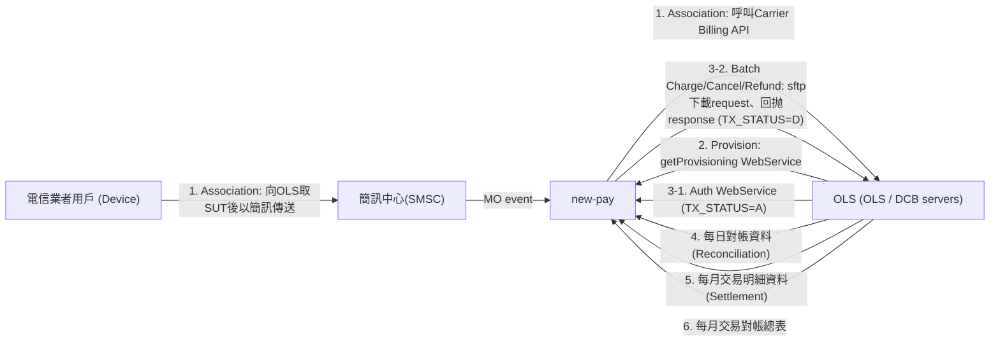
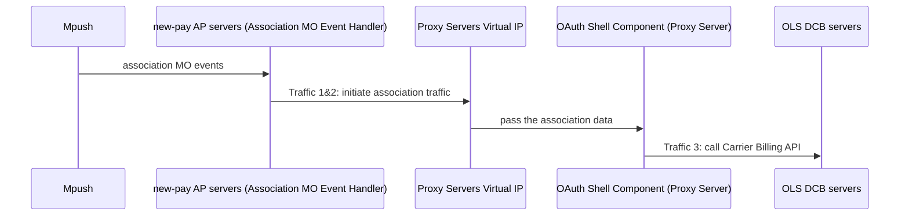
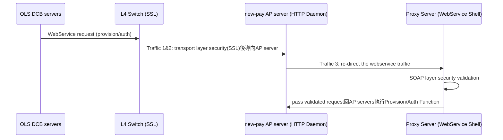
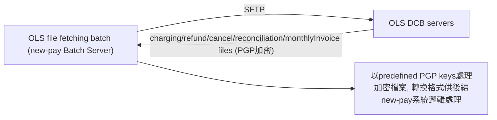
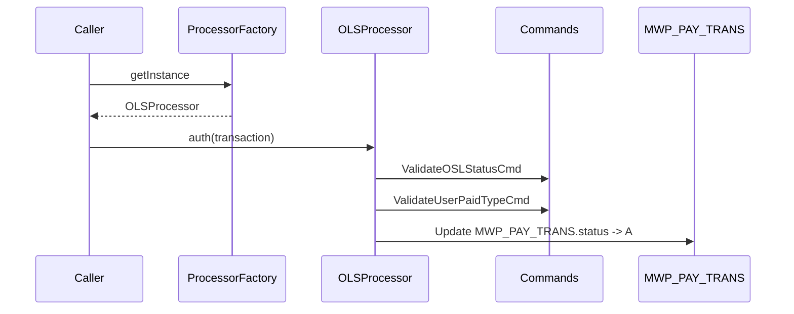
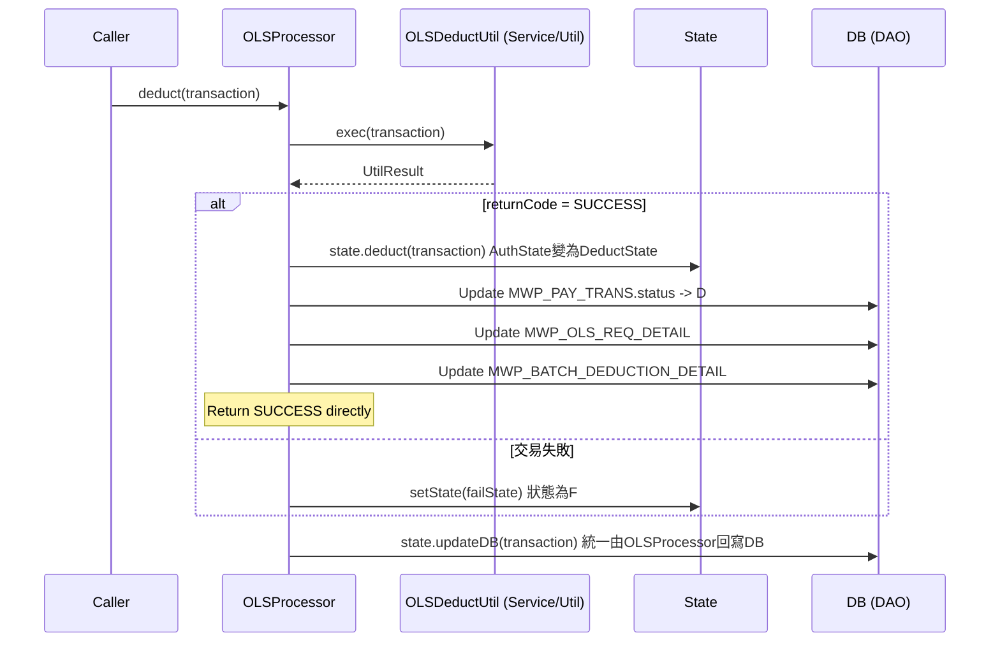
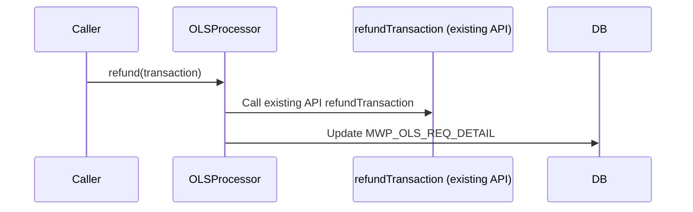
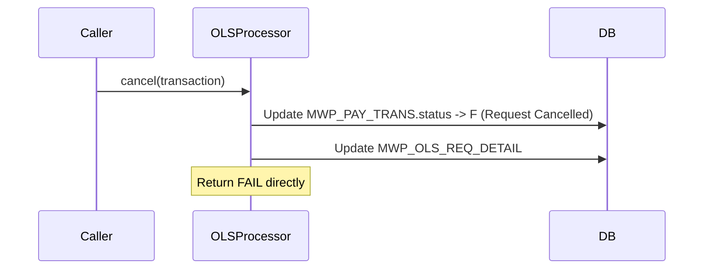
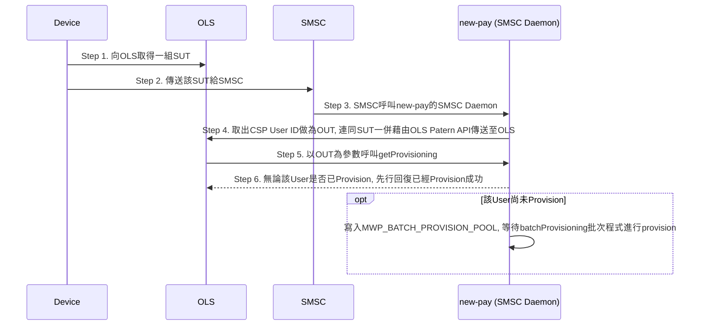
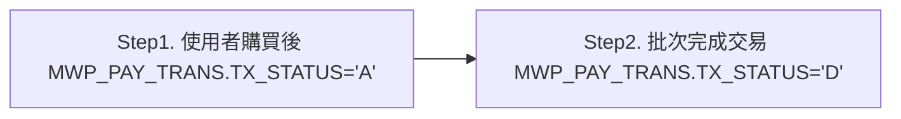

# new-pay OnlineStore — System Design Document (SD)

> 本文件由原始 Detail Design Spec（2013/03/03，作者：[人員A]）去識別化後拆分而成之「系統設計」部分。
> 註：原文件中的圖片無法自 .doc 檔轉出；文中的流程圖與循序圖已依內文文字以 mermaid 重建（非原始圖檔），其餘圖片（架構圖、類別圖、狀態圖、Floor Plan、畫面截圖等）仍佚失。
> 去識別化代換：電信業者名稱→「電信業者 / Telco」、承包廠商名稱→「廠商 / Vendor」、人名→[人員A]~[人員E]、內部網域/email→telco.example.com、PGP 金鑰 ID→[KEYID-n]。

## SIGN-OFF

| | |
|---|---|
| 廠商 / Project manager | 電信業者 / Project Manager |
| 廠商 / Sponsor | 電信業者 / Sponsor |

## Revision History

| Revision Number | Revision Date | Summary of Changes | Changes Marker |
|---|---|---|---|
| 1 | 2013/04/03 | 日/月對帳rule調整->不需考慮日光節約時間、檔案遇到跨天/跨月對帳若不一致一律發alert(4.2.5.3、4.2.6.3) | [人員B] |
| 2 | 2013/04/03 | cancelOLSTransaction API design (4.4.6) | [人員B] |
| 3 | 2013/04/05 | DB Table naming 異動(4.8.1 & 4.8.13) | [人員B] |
| 4 | 2013/04/05 | Physical Architecture(2.2) | [人員C] |
| 5 | 2013/04/05 | Traffic Pattern(2.3) | [人員C] |
| 6 | 2013/04/10 | ToS服務條款功能修正(4.5.1) | [人員B] |
| 7 | 2013/04/11 | 日/月對帳parsing rule補充(4.2.5.2、4.2.6.2) | [人員B] |
| 8 | 2013/04/11 | DB schema修正(4.7.6、4.7.7、4.7.9、4.7.10) | [人員B] |
| 9 | 2013/04/15 | DB naming 異動(4.7.6~4.7.11) | [人員B] |
| 10 | 2013/04/15 | DB schema新增 for mwp_merchant_bank_acc(4.7.18.) | [人員B] |
| 11 | 2013/04/16 | 補充PGP 產生流程(Appendix 1) | [人員B] |
| 12 | 2013/04/16 | Use Case Diagram 修改(3.1) | [人員B] |

---

# 2. System Architecture

## 2.1. Key Component Diagram and Integration Flow

The new-pay OLS Project will follow the transaction flow and framework defined by OLS to perform the transaction integration with OLS. (association/provision/Auth/Charging/Cancel/Refund/Reconciliation/MonthlyInvoice).




1. Association: 當電信業者用戶第一次使用電信業者電信帳單在OnlineStore(OLS)購買商品時，需要先進行Asscoication的動作，將電信業者電信帳單和OLS帳號進行綁定. 電信業者用戶在Device上點選電信業者電信帳單作為付款方式，Device會向OLS索取SUT(Store User Token)。在取到SUT後，將SUT以簡訊方式傳送給電信業者簡訊中心(SMSC). new-pay新增一MO event listener來處理由簡訊中心來的MO event, 並呼叫Carrier Billing API完成Association

2. Provision: 在交易之前，OLS仍然需要向電信業者驗證使用者是否能使用電信帳單付費，new-pay提供getProvisioning WebService 供OLS呼叫，以進行資料認證。

3. 因應OnlineStore的需求，new-pay系統需新增一種單次Auth批次Deduct的交易模式。
   1. 當用戶在OLS選好商品，並決定購買後，OLS會要求用戶輸入密碼，在確認密碼無誤後，OLS為二階段交易，首先會呼叫new-pay提供的Auth WebService進行付費驗證, 即完成第一階段交易，而該交易流程狀態為A(=MWP_PAY_TRANS.TX_STATUS)，new-pay系統會將該筆交易所有資訊存入資料庫，等待交易的第二階段開始。
   2. 在OLS交易第二階段為Batch Charge/Cancel/Refund , OLS會產出交易清單，提供new-pay以sftp加密方式下載。new-pay系統下載後，則以批次程式進行Charge/Cancel/Refund，完成全部交易，再定時把response檔案抛回指定的FTP路徑, 該交易流程完成狀態為D(=MWP_PAY_TRANS.TX_STATUS)。

4. OLS每天會提供電信業者前一日的交易資料以供對帳(Reconciliation)， new-pay可比對雙方的交易以確保雙方交易資料一致，OLS抛來的資料包括前一日的交易request及response內容。

5. OLS每天會提供電信業者前一月的交易明細資料以供拆帳(Settlement)， new-pay可比對雙方的交易以確保雙方交易資料一致，OLS抛來的資料包括前一月的銷售及退款資料。

6. OLS每天會提供電信業者前一月的交易對帳總表， new-pay至FTP抓取後存放於指定Folder，以供User下載。

## 2.2. Physical Architecture

New Proxy Servers will be buildup to ensure the environment requirement for CXF/WSS4J framework could be met. The Proxy Servers will be responsible to provide the WebService interface for OLS pvovision/Auth purpose, and the OAuth communication service interface will also be deployed in the proxy server to carry on the association traffic communication with OLS Carrier Billing API.

The core business logic will be implemented in current new-pay AP/Batch servers. Only the webservice/oauth interface will be deployed in the new Proxy Servers.

Proxy Server HW Spec:

| Sub-System | Module | Qty |
|---|---|---|
| Production - Proxy Server | [Server Model] - Intel Xeon QC 2.0 GHz/1333MHz/8MB L2 Cache x 2 - 內建IDE Slimline DVD-ROM Drive X1 - 73GB HDD X2 - 4G RAM (1GX4) - Gigabit Ethernet Adapter X3 - Redundant Power | 2 |
| Staging - Proxy Server | [Server Model] - Intel Xeon QC 2.0 GHz/1333MHz/8MB L2 Cache - 內建IDE Slimline DVD-ROM DriveX1 - 73GB HDD X2 - 4G RAM (1GX4) - Gigabit Ethernet Adapter X3 - Redundant Power | 1 |

Proxy Server OS Partitioning Design Spec:

| Partition | Size |
|---|---|
| /boot | 1024 MB |
| / | All the remaining |
| Swap | 8192 MB |
| /var | 4096 MB |
| /usr | 32 GB |
| /tmp | 16 GB |
| /home | 4096 MB |

Proxy Server Floor Plan:

The production/Staging OLS Proxy Servers will be on the X20 rack, and the servers will connect to the L4 switch on I02 via the panel on I01. For the NBU server connection, the traffic will be connected to V08 via the panel on X19.

IP Survey Table for the new Proxy Servers:

TBD

## 2.3. Key new-pay OLS Traffic Pattern

### Association Traffic:

new-pay AP servers are responsible for taking association MO events from Mpush and initiating the association traffic back to ols DCB servers.

- Traffic 1&2: Association MO Event Handler on new-pay AP servers initiate the association traffic and call Vitual IP of the proxy servers to pass the association data to the OAuth Shell Component.
- Traffic 3: OAuth Shell Component is responsible to complete the association traffic by calling the Carrier Billing API on OLS DCB servers.




### WebService Traffic for Provision/Auth:

The OLS DCB servers will invoke the WebServices implemented in Telco new-pay environment for provision/auth purpose.

- Traffic 1&2: The WebService request will be directed to new-pay AP server first right after transport layer security (SSL) is carried out by L4 Switch.
- Traffic 3: the HTTP Daemon will re-direct the webservice traffic to proxy servers. The WebService Shell components deployed on Proxy Servers will take care the SOAP layer security validation, and then pass the validated request back to AP servers for Provision/Auth Function execution.




### SFTP File Fetching Traffic:

The OLS file fetching batch will SFTP to OLS DCB servers to fetch the charging/refund/cancel/reconciliation/monthlyInvoice files back and process those encrypted files with the predefined PGP keys to make the files transform into proper format for the following new-pay system logic processing.




---

# 4.1. Pilot revamp for new-pay SDK

## 4.1.1. Assumption

- 以new-pay現行軟體環境進行revamp設計，其WAS版本為6.0.2，JDK版本為1.4.2。
- 本案設計及開發所依據的JDK版本皆為1.4.2，並相容於JDK1.5，電信業者若升級至JDK 1.5後續版本，不能保證程式碼相容性及Library的共同性。
- 本案所開發的SDK，與原有的SDK並行使用。

## 4.1.2. 系統架構說明

### AS-IS

現行new-pay SDK架構如下圖所示：

new-pay提供SDK供電信業者商家(CP)使用，包括儲值繳費、四大Store及外部商家等。由於new-pay系統運行已久，針對不同的商家需求及限制，開發了數量眾多的API供商家呼叫使用。但因為歷史因素，API之間偶有互相呼叫使用的情形，API本身耦合性(high couple)強，陸續出現程式碼重覆、效能不佳，修改不易的狀況。

為避免類似的問題再發生，本次的OnlineStore需求，將針對SDK架構進行調整，說明如下節(TO-BE)。

### TO-BE

下圖所示，橘色區塊為調整後的新架構，紫色區塊為現行的架構。

如圖所示，在本案中，將調整原有的API架構為三層，分別為：

1. Processor APIs：與交易相關的API，將訂定為不同的Processor，比如本案中的與OnlineStore的整合，即是一個新的交易模式，故獨立為一個新的Processor(OLS Processor)。Processor中利用State Pattern控管交易的流程與狀況，若需要進行Authorize或Deduct等動作，則是呼叫Service APIs這層的API進行(詳情請參看後續章節的說明)。

2. Service APIs：因應不同的交易及資訊存取需求，提供各式各樣的API供外部系統取用，以OLS Processor為例，其交易行為包括Initial(get TXID)、Authorize Purchase及Deduct，這行為在Service APIs層為各自獨立的API，未來若有其他的Processor，也可重覆使用，減少重覆撰寫API的狀況發生。

3. Commands：在各個Service API中，也會有重覆使用的元件，例如驗證Acc ID是否存在？TX ID是否重覆？這些元件在Commands層被獨立成一個個單獨的method，供API使用。

## 4.1.3. OLS Processor

目前new-pay系統肩負電信業者多項付費及訂閱機制，除界接電信業者四大Store，2013年起亦將陸續與OLS及其他國際電商進行整合。放眼未來，new-pay將會有更多樣、更彈性的付款方式及流程，因應此趨勢，為提升系統開發的速度及彈性，將依據本案之需求，提前進行revamp的規則，設計OLSProcessor以處理OLS相關的交易需求及控管交易流程。

下圖為OLSProcessor關連物件圖，說明請參見以下各節：

### Processor & OLS Processor

設計Processor的目的，在統整new-pay的交易過程，將交易過程中各個交易階段拆解並將對應的交易行為標準化，以建置可重覆使用的模組，以利日後管理及擴充。

如下圖所示，在Processor中，明確定義了一個交易的流程(Processor)會有那些標準行為，如init、auth等。依據OLS的交易特性，繼承Processor建立了OLSProcessor，OLSProcessor只需針對與標準行為不同的行為進行客製即可。

未來OneClickDeduction如果要使用Processor的方式做revamp，也是繼承Proccessor class，並針對init、auth等method進行overwrite即可。

依Processor的設計，當new-pay收到一個交易需求(如deduct)，需先呼叫ProcessorFactory.getInstance，Factory依其交易特性產生對應的Processor(如OLSProcessor)，再將交易資料傳入OLSProcessor定義的行為(OLSProcessor.deduct())，即可以進行交易動作。

目前儘有OnlineStore在使用Processor的架構，故getInstance時直接判定為OLSProcessor。

### State Pattern for OnlineStore交易

由於new-pay交易過程有各程不同的交易狀況(transaction status)，導入GOF的State Design Pattern是最佳的設計方式。State Design Pattern可將與流程相關的邏輯封裝，可達到低耦合與重用的目的，並且提高未來維護程式碼時的安全性，避免在未來新增或是修改流程時，人為可能發生的錯誤。

new-pay 系統交易/訂閱流程共同的狀態變化如下表/圖所示：

| # | 狀態 | 狀態名稱 | 說明 |
|---|---|---|---|
| 1 | I (Init) | 初始狀態 | 交易初始，於資料庫產生交易資料 |
| 2 | E (Expired) | 操作逾時狀態 | 該項交易/訂閱流程，超過系統規範timeout時間，未有任何反應，則會進入狀態E |
| 3 | F (Fail) | 錯誤狀態 | 任何操作發生錯誤，則會進入錯誤狀態 |
| 4 | A (Auth) | 授權/認證成功狀態 | |
| 5 | D (Deduct Done) | 交易完成狀態 | 已經完成交易/訂閱後，則會進入交易完成狀態 |
| 6 | OR (Order Reversal) | 交易註銷 | 交易完成後一小時內CP 可以要求交易註銷(Reversal)，OLS未使用此狀態。 |
| 7 | F (for Cancel) | 交易取消 | Two Phase Commit 交易，未請款前CP要求取消已授權交易，Return Code為Request Cancel |
| 8 | Refund | 交易退款 | 交易成功後，進行退款且成功 |

下圖為依據State Pattern設計出來的State物件群，在最上層有一個State Interface，定義了每個State可能的行為，並依上表所列各種State進行實作。

以AuthState為例，若某筆交易在進行OLSProcess時的Status為A(Auth)，在做完deduct成功之後，其Status應變更成D(Deduct Done)，則在OLSProcessor，變更Status的寫法應為：

```java
public void deduct(TX transaction) {
  DeductUtil olsDeduct = new OLSDeductUtil(); //產生deduct交易物件
  UtilResult result = olsDeduct.exec(transaction); //抛入交易資訊進行deduct
  if("SUCCESS".equals(result.getReturnCode())) //若交易成功，應更新狀態為D
   this.state.deduct(transaction);
   /*呼叫state中的deduct，將state變為DeductState，原本為AuthState*/
   /*由state.deduct()來處理status的變更 */
  else //若交易失敗，狀態為F
   this.setState(this.failState);
  this.state.updateDB(transaction); //統一由OLSProcessor回寫DB
 }
```

下圖為OLSProcessor中各種State的變化及合法行為：

### Processor、Service及Command

依據 4.1.2.2所述，OLSProcess的架構分為Processor、Server及Command三層，其對應的class如下圖所示：

註：由於Service這個package name已被其他功能使用，故圖中的Util指的就是規劃中的Service層。

1. Processor：使用State Pattern控管控管交易的Status，並負責利用DAO存取資料庫。

2. Service(Util)：提供method供Porcessor實行交易中各種不同的行為，並因應後端commad處理結果，回傳訊息。

3. Command：重覆使用的元件，包括驗證及檢查等，如OLSAuth中要做的ValidateOSLStatus及ValidateUserPaidType。

OLSProcessor中使用的Service(Util)及Command請參見下表：

| Service | Command | DB updated by OLSProcessor | Remark |
|---|---|---|---|
| OLSProcessor.auth | ValidateOSLStatusCmd | Update MWP_PAY_TRANS.status -> A | |
| | ValidateUserPaidTypeCmd | | |
| OLSProcessor.deduct | | Update MWP_PAY_TRANS.status -> D | Return SUCCESS directly |
| | | Update MWP_OLS_REQ_DETAIL | |
| | | Update MWP_BATCH_DEDUCTION_DETAIL | |
| OLSProcessor.cancel | | Update MWP_PAY_TRANS.status -> F (Request Cancelled) | Return FAIL directly |
| | | Update MWP_OLS_REQ_DETAIL | |
| OLSProcessor.refund | N/A | Update MWP_OLS_REQ_DETAIL | Call existing API: refundTransaction |

### Sequence for Auth




### Sequence for Deduct




### Sequence for Refund




### Sequence for Cancel




---

# 4.3. SDK調整

## 4.3.1. ADD Shell: getProvisioning

## 4.3.2. ADD Core: getProvisioning

系統架構

- shell層 新增SOAP GetProvisioning api interface
- core層 新增provisioning function，邏輯如下 所列
- 新增SMSC Daemon，用以接聽來自於SMSC的即時訊息
- 新增呼叫Partner API的程式，傳遞SUT對應的OUT到OLS Server

Provision Rule:

- Step 1. 由Device 向OLS取得一組SUT
- Step 2. Device傳送該SUT給SMSC，
- Step 3.再由SMSC呼叫new-pay的 SMSC Daemon
- Step 4.new-pay取出CSP User ID做為 OUT，連同SUT一併藉由OLS Patern API傳送至OLS
- Step 5. OLS以OUT為參數向new-pay 呼叫getProvisioning
- Step 6. 無論該User 是否已Provision，new-pay先行回復已經Provision成功；若該User尚未Provision，則寫入MWP_BATCH_PROVISION_POOL，等待batchProvisioning 批次程式，進行provision




## 4.3.3. ADD Shell: Auth

目前new-pay系統與交易相關的流程，有其共通性，由MWP_PAY_TRANS中的TX_STATUS分析，可以得知交易狀態可以分為—Initial、Auth(authorize/authentic)、Deduct與Fail四種(BPM要求多加Cancel)，但每種流程又有其特殊性，因此我們採用Gof的State Design Pattern，作為該類流程相關business rule的封裝，除了讓程式邏輯封裝後提高安全性，並可以讓共用邏輯反覆使用，避免產生多餘的程式碼。

### State Diagram

系統架構

- shell層 新增SOAP Auth api interface
- core層 新增auth function，邏輯如下所列

Auth Rule:

OnlineStore Flow (2 Phase commitFirst Phase)

說明：當OnlineStore的交易，藉由Web Service傳送到new-pay系統，資料會由初始化狀態，經過查驗身分無誤的話，會將該流程資料存入db，待後續處理。

- Step1.使用者購買後，new-pay的 MWP_PAY_TRANS.TX_STATUS='A'
- Step2. 批次完成交易，new-pay 的MWP_PAY_TRANS.TX_STATUS='D'




### OlsDeductProccessor Class Diagram

說明：

與交易流程相關的程式碼，將以 State Design Pattern設計，所有與程序有關的檢核、狀態控管的邏輯，會被封裝於此。未來所有程序會繼承此組interface/abstract class，以達到低耦合與重用的目標。所有business rule 也會分別放在不同的class裡，提供程式維護的安全性。

## 4.3.4. ADD Core ServiceAPI: authorizeOLSPurcharse

### API description

<[人員A]>

會跟[人員D]確認每個Command的用途，並提供說明，若有不需要的項目會作刪除

Telco可用OLS交易的rule是

- 判定Paid Type=8
- 判定GSM Status是否為active

Commands:

- AuthorizeUserByCSP
- AuthorizeUserByCSP4Deduct
- CheckUserAcctLock
- MerchantSupportTranType
- NotAllowHybirdUser
- PurchaseDataMatch
- SyncCSPProfile
- UserAllowPaymethod
- ValidateGSMStatus
- ValidateROCIDLock

### addUserBankAccount API (I0121)

#### API description

Use addUserBankAccount to add user bank account information to payment system. Each customer can only add three bank account.

#### Input Description

| Name | Type | Max Len | Mandatory | Description |
|---|---|---|---|---|
| accID | String | 60 | Yes | MWP user MSISDN or ACCID. |
| bankCode | String | 3 | Yes | Bank code |
| BANumber | String | 16 | Yes | Bank account |
| channel | String | 10 | Yes | The channel to modify the user profile. Following channels are allowed in MWP: WEB,WAP |

#### Input and Output

Input

- String: acid
- String: bankCode
- String: BANumber
- String:channel

Output

- String:

```
I01210000|Invalid account id or MSISDN
I01210001|Invalid bank code
I01210002|Invalid bank account number
I01210003|The quantity of the bank account more than three.
I01210004|Invalid channel
I01210005|The bank account is exist
I01210101|The user type is not allowed to use the API
I01219900|System errors
```

## 4.3.5. ADD Shell: echo

## 4.3.6. ADD Core: cancelOLSTransaction

### API description

- 用戶於Trial Window時間內可以解除安裝已下載的App Content
- 已經Charge不能Cancel
- 已經Refund不能 Cancel
- 需update mwp_pay_trans以及 mwp_ols_req_detail

1. 讀取MWP_OLS_BATCH table內容，將type為 Cancel的記錄取出，並將STATUS改為A
2. 藉由每筆記錄的 CORRELATION_ID欄位資料，對應到相關的TXID，將MWP_PAY_TRANS.TX_STATUS改為 'F'，完成cancel，MWP_PAY_TRANS.return_code="Request Cancel"， MWP_PAY_TRANS.modify_date=sysdate()
3. 回寫MWP_OLS_BATCH table ，將STATUS改為 D
4. Update response fileds of MWP_OLS_REQ_DETAIL

### HTTP URL name

| Protocol | Name |
|---|---|
| HTTP | Com.telco.mwp.servlet.CancelOLSTX |

### XML Tags Description

| Name | Type | Max Len | Mandatory | Description |
|---|---|---|---|---|
| MWPSDKXML | | | | |
| merchantID | String | 10 | Yes | The merchant ID which calls the API. |
| merchantPassword | String | 12 | Yes | The password of the merchant. |
| TXID | String | 15 | Yes | new-pay交易序號 |

### Input and Output

Input

String: MWPSDKXML

```xml
<MWPSDKInput>
<merchantID></merchantID>
<merchantPassword></merchantPassword>
  <TXID></TXID>
<MWPSDKInput>
```

Output

1. cancel成功

```xml
<MWPSDKOutput>
<returnCode>E00000000</returnCode>
<description>Success</description>
</MWPSDKOutput>
```

2.

```xml
<MWPSDKOutput>
<returnCode>E30010000</returnCode>
<description>Invalid XML string (Show the tag name) </description>
</MWPSDKOutput>
```

3.

```xml
<MWPSDKOutput>
<returnCode>E30010001</returnCode>
<description>Invalid Parameter|(Show the parameter name)
</description>
</MWPSDKOutput>
```

4.

```xml
<MWPSDKOutput>
<returnCode>E30010100</returnCode>
<description>Not authorized to use the API </description>
</MWPSDKOutput>
```

5. TXID not found

```xml
<MWPSDKOutput>
<returnCode>E30010002</returnCode>
<description>Transaction NOT found</description>
</MWPSDKOutput>
```

6. Already Charged

```xml
<MWPSDKOutput>
<returnCode>E30010003</returnCode>
<description>The Transaction has already been charged</description>
</MWPSDKOutput>
```

7. Already Canceled

```xml
<MWPSDKOutput>
<returnCode>E30010004</returnCode>
<description>The Transaction has already been canceled</description>
</MWPSDKOutput>
```

8. System Error

```xml
<MWPSDKOutput>
<returnCode>E30019900</returnCode>
<description>System errors|(Show error description)</description>
</MWPSDKOutput>
```

## 4.3.7. ADD Core: refundOLSTransaction

1. 讀取MWP_OLS_BATCH table內容，將type為 Refund的記錄取出，並將STATUS改為A
2. 藉由每筆記錄的 CORRELATION_ID欄位資料，對應到相關的TXID
3. 將該筆交易記錄，進行new-pay Phone Bill 的 Refund程序
4. 回寫MWP_OLS_BATCH table ，將STATUS改為 D

---

# 4.4. Batch調整

## 4.4.1. ADD: ProcessOLSReqFiles

請參考 4.2.4.4節說明。

## 4.4.2. ADD: BuildOLSResFiles

請參考 4.2.4.5節說明。

## 4.4.3. ADD: getOLSRequest

請參考 4.2.4.3節說明。

## 4.4.4. ADD: putOLSResponse

請參考 4.2.4.6節說明。

## 4.4.5. ADD: OLSChargeMonitor

請參考 4.2.4.7節說明。

## 4.4.6. ADD: getOLSReconfiles

請參考 4.2.5.2節說明。

## 4.4.7. ADD: getOLSMonthlyInvoice

請參考 4.2.6.2節說明。

## 4.4.8. ADD: reconOLSDaily

請參考 4.2.5.3節說明。

定時報表每日對帳功能

- cron每日批次至ols SFTP Server下載日報表檔至指定目錄。
- 每日比對交易資料，異常發告警e-mail至指定群組以利人工處理。
- 異常種類：new-pay報表多於ols報表或ols報表多於new-pay報表

## 4.4.9. ADD: reconOLSMonthly

請參考 4.2.6.3節說明。

提供每月拆帳報表對帳功能

- cron每月批次至ols SFTP Server下載月拆帳報表檔並傳送到指定目錄。
- 每月比對交易資料，異常發告警 e-mail至指定群組以利人工處理。
- 異常種類：new-pay報表多於ols報表或ols報表多於new-pay報表

## 4.4.10. ADD: reconOLSSummary

請參考 4.2.7節說明。

提供每月拆帳報表對帳功能

- cron每月批次至ols SFTP Server下載月拆帳總表檔並傳送到指定目錄。

## 4.4.11. Modify: GetOrderDetail(E0504)

- 回覆中的Note欄位，要combine MWP_PAY_TRANS.reference的值，並用”,”分開。

---

# 4.7. Schema調整

## 4.7.1. ADD Table: MWP_SMS_OLS

| Column Name | Data Type | Null | Default | Comment | Sample |
|---|---|---|---|---|---|
| ID | VARCHAR2(20) | N | | Pkey , | |
| Create_Time | VARCHAR2(14) | N | | | |
| Source_SMS_Content | VARCHAR2(128) | N | | | |
| Source_MSISDN | VARCHAR2(20) | N | | | |
| Req_Content | VARCHAR2(128) | | | | |
| Status | VARCHAR2(2) | N | | D:Done  F: fail | |
| Req_Time | VARCHAR2(21) | | | | |
| Ret_Code | VARCHAR2(16) | | | 00000000:Success 00000001:Nonpostpaid user 00000002:nonCSP 00000003:Request Timeout 00000004:formatError 00000005:DCB Error | |
| Ret_Description | VARCHAR2(128) | | | | |

## 4.7.2. ADD Table: MWP_OLS_SOAP_Provisioning

OLS呼叫new-pay getProvisioning所有 Input/Output行為，皆存入此table以便後續查核

| Column Name | Data Type | Null | Default | Comment | Sample |
|---|---|---|---|---|---|
| ID | VARCHAR2(32) | N | | Pkey, | |
| Create_Time | VARCHAR2(14) | N | | The time which deduction file is conducted. | |
| Request_XML | VARCHAR2(256) | N | | | |
| Correlation_ID | VARCHAR2(20) | N | | OLS OrderNo | |
| OUT | VARCHAR2(20) | N | | | |
| Prov_Result | VARCHAR2(20) | | | | |
| Is_Provisioned | VARCHAR2(20) | | | | |
| Resp_XML | VARCHAR2(256) | | | | |

## 4.7.3. ADD Table: MWP_OLS_SOAP_Auth

OLS呼叫new-pay auth所有 Input/Output行為，皆存入此table以便後續查核

| Column Name | Data Type | Null | Default | Comment | Sample |
|---|---|---|---|---|---|
| ID | VARCHAR2(32) | N | | Pkey, | |
| Create_Time | VARCHAR2(14) | N | | The time which deduction file is conducted. | |
| Request_XML | VARCHAR2(256) | N | | | |
| Correlation_ID | VARCHAR2(20) | N | | OLS OrderNo | |
| Purchase_Time | VARCHAR2(21) | N | | 存入mwp_pay_trans.auth_dt | |
| OUT | VARCHAR2(20) | N | | | |
| Payment_Description | VARCHAR2(128) | N | | | |
| Merchant_Contact | VARCHAR2(128) | N | | | |
| Price | VARCHAR2(21) | N | | | |
| Rounded_Price | NUMBER(8,0) | N | | 四捨五入後的金額 | |
| Auth_Result | VARCHAR2(20) | | | | |
| Auth_TXID | VARCHAR2(20) | | | | |
| Resp_XML | VARCHAR2(256) | | | | |

## 4.7.4. ADD Table: MWP_OLS_REQ_LOG

存OLS Batch RequestFile/ResponseFile Input/Output information

| Column Name | Data Type | Null | Default | Comment | Sample |
|---|---|---|---|---|---|
| REQ_ID | VARCHAR2(32) | N | | pKey, | |
| CREATE_TIME | VARCHAR2(14) | N | | The time which deduction file is conducted. | |
| FILE_NAME | VARCHAR2(20) | N | | | |
| STATUS | VARCHAR2(2) | N | | I: initial batch file,Request file is accepted / P: parsing. / PD: parsing D. F: deduction file parsing error or system error / D: generate response file | |
| RESP_TIME | VARCHAR2(14) | Y | | The Time which response file is generated. | |
| RESP_FILE_NAME | VARCHAR2(20) | Y | | The deduction response filename was generated. | |
| LAST_MOD_TIME | VARCHAR2(14) | N | | The last modified time on the LogRecord | |

## 4.7.5. ADD Table: MWP_OLS_REQ_DETAIL

| Column Name | Data Type | Null | Default | Comment | Sample |
|---|---|---|---|---|---|
| REQ_ID | VARCHAR2(32) | N | | pKey, | |
| REQ_TYPE | VARCHAR2(128) | N | | 交易型態 | |
| REQ_TIMESTAMP | VARCHAR2(21) | N | | Request recived by OLS | |
| CORRELATION_ID | VARCHAR2(64) | N | | | |
| BILLING_AGREEMENT_ID | VARCHAR2(64) | N | | | |
| RESP_TIMESTAMP | VARCHAR2(21) | | | Reqponse time processed by new-pay | |
| RESULT_CODE | VARCHAR2(128) | | | | |
| MESSAGE | VARCHAR2(1024) | | | | |

## 4.7.6. ADD Table: MWP_CP_RECON_DAILY_LOG

| Column Name | Data Type | Null | Default | Comment | Sample |
|---|---|---|---|---|---|
| RECON_ID | VARCHAR(20) | N | | | |
| RECON_SEQ_NUM | VARCHAR(5) | N | | RECON_ID+RECON_SEQ_NUM 為unique key, 可用來辨別一天當中的特定檔案 | 00000、00001、00002 |
| MERCHANT_ID | VARCHAR2(20) | N | | | |
| File_Name | VARCHAR2(80) | N | | | |
| CP_TX_DT | VARCHAR2(8) | N | | OLS報表時間(台灣時間, GMT+8) | |
| CREATE_TIME | VARCHAR2(14) | N | | 將recon file匯入DB的時間 | |
| Status | VARCHAR2(2) | N | | I: initial ;PD: parsing done.;PF: file parsing error or system error; D: reconciliate done F: reconciliate fail or system error | |

## 4.7.7. ADD Table: MWP_CP_RECON_DAILY_DETAIL

CP抓到的對帳檔內容會被parsing入Mwp_cp_recon_daily_detail

| Column Name | Data Type | Null | Default | Comment | Sample |
|---|---|---|---|---|---|
| RECON_ID | VARCHAR2(20) | N | | 參照MWP_CP_RECON_DAILY_ LOG.RECON_ID | |
| RECON_SEQ_NUM | VARCHAR(5) | N | | | 00000、00001、00002 |
| MERCHANT_ID | VARCHAR2(20) | N | | | |
| Billing_Agreement_Id | VARCHAR2(64) | N | | | |
| Correlation_Id | VARCHAR2(64) | N | | | |
| SQE_NUM | NUMBER(8,0) | N | | 檔案內容序號 | |
| TXID | VARCHAR2(20) | | | mwp_pay_trans裡的交易序號 | |
| Status | VARCHAR2(128) | | | | |
| Item_Price | VARCHAR2(21) | | | 稅前金額 | |
| Tax | VARCHAR2(21) | | | | |
| Total_Amount | VARCHAR2(21) | N | | 稅後金額(需charge user的金額) | |
| Round_Amount | NUMBER(8,0) | N | | 捨入的金額 | |
| Currency | VARCHAR2(4) | | | | USD、TWD |
| Last_Event | VARCHAR2(128) | | | 搭配status的event，且為交易最後的事件紀錄 | AUTH、CANCEL、CHARGE、REFUND |
| Timestamp | VARCHAR2(21) | | | 商家端傳入的請款時間 or Telco 端的帳單請款時間 (需轉 GMT+8) | |
| Event_Response | VARCHAR2(128) | | | new-pay端回覆OLS的payment response | |
| Event_Response_Description | VARCHAR2(1024) | | | | |
| CREATE_TIME | VARCHAR2(14) | N | | 將recon file匯入DB的時間 | |
| RECON_RESULT | VARCHAR2(3) | | | | |
| RECON_MESSAGE | VARCHAR2(80) | | | | |

## 4.7.8. ADD Table: MWP_CP_RECON_DAILY_SUMMARY

| Column Name | Data Type | Null | Default | Comment | Sample |
|---|---|---|---|---|---|
| RECON_ID | VARCHAR(20) | N | | pKey | |
| MERCHANT_ID | VARCHAR2(20) | N | | | |
| RECON_RESULT_SUMMARY | VARCHAR2(1) | | | 日對帳總結果:Y:對帳正常; N:對帳異常 | |
| DIFF_COUNT | NUMBER(8,0) | | | OLS與new-pay日對帳總差異筆數 | |
| CP_TX_DT | VARCHAR2(8) | N | | 報表交易日期 | |
| CP_TOTAL_CONUT | NUMBER(8,0) | | | OLS當日交易總筆數 | |
| NEWPAY_TOTAL_COUNT | NUMBER(8,0) | | | new-pay當日交易總筆數 | |
| CP_FILE_NAME | VARCHAR2(80) | | | OLS原始日對帳檔名稱 | |

## 4.7.9. ADD Table: MWP_CP_RECON_MONTHLY_LOG

| Column Name | Data Type | Null | Default | Comment | Sample |
|---|---|---|---|---|---|
| RECON_ID | VARCHAR(20) | N | | | |
| RECON_SEQ_NUM | VARCHAR(5) | N | | RECON_ID+RECON_SEQ_NUM 為unique key, 可用來辨別當月中的特定檔案 | 00000、00001、00002 |
| MERCHANT_ID | VARCHAR2(20) | N | | | |
| File_Name | VARCHAR2(80) | N | | | |
| CP_TX_DT | VARCHAR2(8) | N | | OLS報表時間(台灣時間, GMT+8) | |
| CREATE_TIME | VARCHAR2(14) | N | | 將monthly invoice report匯入DB的時間 | |
| Status | VARCHAR2(2) | N | | I: initial ;PD: parsing done.;PF: file parsing error or system error; D: reconciliate done F: reconciliate fail or system error | |

## 4.7.10. ADD Table: MWP_CP_RECON_MONTHLY_DETAIL

CP抓到的月對帳檔內容會被parsing入MWP_CP_RECON_MONTHLY_DETAIL

| Column Name | Data Type | Null | Default | Comment | Sample |
|---|---|---|---|---|---|
| RECON_ID | VARCHAR2(20) | N | | 參照MWP_CP_RECON_MONTHLY_LOG.RECON_ID | |
| RECON_SEQ_NUM | VARCHAR(5) | N | | | 00000、00001、00002 |
| MERCHANT_ID | VARCHAR2(20) | N | | | |
| Billing_Agreement_Id | VARCHAR2(64) | N | | | |
| Correlation_Id | VARCHAR2(64) | N | | | |
| SQE_NUM | NUMBER(8,0) | N | | 檔案內容序號 | |
| TXID | VARCHAR2(20) | | | mwp_pay_trans裡的交易序號 | |
| Event | VARCHAR2(128) | | | 跟拆帳有關的event，僅會出現CHARGE或REFUND | |
| Item_Price | VARCHAR2(21) | | | 稅前金額 | |
| Tax | VARCHAR2(21) | | | | |
| Total_Amount | VARCHAR2(21) | | | 稅後金額(需charge user的金額) | |
| Round_Amount | NUMBER(8,0) | N | | 捨入的金額 | |
| Currency | VARCHAR2(4) | | | 幣別 | USD、TWD |
| Timestamp | VARCHAR2(21) | | | 商家端傳入的請款時間 or Telco 端的帳單請款時間 (需轉 GMT+8) | |
| CREATE_TIME | VARCHAR2(14) | N | | 將monthly invoice report匯入DB的時間 | |
| RECON_RESULT | VARCHAR2(3) | | | | |
| RECON_MESSAGE | VARCHAR2(80) | | | | |

## 4.7.11. ADD Table: MWP_CP_RECON_MONTHLY_SUMMARY

| Column Name | Data Type | Null | Default | Comment | Sample |
|---|---|---|---|---|---|
| RECON_ID | VARCHAR(20) | N | | pkey | |
| MERCHANT_ID | VARCHAR2(20) | N | | | |
| CP_TX_DT | VARCHAR2(8) | N | | 報表交易月份 | |
| CP_TOTAL_CONUT | NUMBER(8,0) | | | OLS當月交易總筆數 | |
| NEWPAY_TOTAL_COUNT | NUMBER(8,0) | | | new-pay當月交易總筆數 | |
| CP_DETAIL_FILE_NAME | VARCHAR2(80) | | | OLS原始月交易明細檔名稱 | |
| CP_SUMMARY_FILE_NAME | VARCHAR2(80) | | | OLS原始月交易總表檔名稱 | |

## 4.7.12. ADD Table: MWP_OLS_BDEDUCTION_LOG

## 4.7.13. ADD Table: MWP_OLS_ToS

| Column Name | Data Type | Null | Default | Comment | Sample |
|---|---|---|---|---|---|
| Merchant_ID | VARCHAR2(10) | N | | 主要商家代碼，若為共同條款，則為I00000000 | |
| ToS_Version | Number(8,0) | N | 1 | ToS版本 | |
| ToS_URL | VARCHAR2(256) | N | | ToS URL | |
| ToS_Content | BLOB | N | | ToS內容 | |
| ToS_Note | VARCHAR2(1024) | Y | | ToS註記 | |
| ToS_Modified_Date | VARCHAR2(14) | N | | ToS最後修改時間 | |
| ToS_Start_Date | VARCHAR2(14) | N | | ToS生效時間 | |

## 4.7.14. ADD Sequence: olsProvTXSeq

## 4.7.15. Modify Table: MWP_User

- 新增欄位CSP_Paid_Type

## 4.7.16. Modify Table: MWP_PAY_TRANS

- Add mwp_pay_trans.reference
- Add mwp_pay_trans.auth_dt

## 4.7.17. Modify Table: MWP_PAY_REFUND

- Add mwp_pay_refund.refund_date(存batch request file 中 type=REFUND的 timestamp，時間需轉換成new-pay時間格式)

## 4.7.18. Modify Table: MWP_MERCHANT_BANK_ACC

| Column Name | Data Type | Null | Default | Comment | Sample |
|---|---|---|---|---|---|
| IS_DOMESTIC | VARCHAR2(1) | N | Y | 國內銀行：Y 國外銀行：N | |

---

# 4.8. OLS介接需求驗證

## 4.8.1. ADD：Web Service(SOAP 1.1)

請[人員A]補充

## 4.8.2. ADD：PGP

請[人員A]補充

---

# 4.9. Assumption 說明

---

# Appendix

## 1. PGP Key Generation Flow

　　為符合OLS規格(BatchAPIGuide-DCB-v109.pdf)要求，且為確保資料在Internet上傳輸安全性，故在本專案中一旦透過Batch API資料傳輸皆需使用PGP加密方式。PGP是一種PKI(Public Key Infrastructure)公開金鑰的加密方式，使用非對稱式加密演算法，加密時使用接收對方的公鑰(public key)加密，接收後只能以接收者的私鑰(private key)解密。

　　當初次使用PGP軟體時，產生的key ring(鑰匙圈)便包含了公鑰跟私鑰，鑰匙圈裡會有自己產生的公私鑰以及與你資料來往方的公鑰，公鑰(public key)是給資料來往方(ex. OLS)使用的，因此OLS若要傳輸加密檔案至Telco，就必須使用Telco產生的公鑰加密，私鑰(private key)是自己使用的，可用來解密以及對公鑰簽章(確認資料來往方公鑰正確無誤，以提升安全性)，私鑰分成master key與subkeys，前者用來簽章，後者用來加解密。一個私鑰只有一個master key但允許很多組subkeys。目前廣泛使用的PGP加密軟體為GnuPG，可用於加密、數位簽章、以及產生非對稱鑰匙，本專案亦使用GnuPG軟體產生金鑰。

本專案產生/匯出key、匯入OLS public key以及驗證指令如下：

1. 產生一組key(public key & private key)

```
gpg --gen-key
```

2. 匯出 Telco private key至另外一台電腦/server可以同時使用此組key

```
gpg --armor --output aptest.wallet.telco.example.com.private.pgpkey --export-secret-keys [KEYID-1]
```

3. FTP/SSH至另一台server將 private key匯入，檔案會存在該user目錄底下的.gnupg裡。

```
gpg --import aptest.wallet.telco.example.com.private.pgpkey
```

驗證

display :

```
gpg: `/Users/[user]/.gnupg/secring.gpg' 鑰匙圈已建立
gpg: 金鑰 [KEYID-2]: 私鑰已匯入
gpg: 金鑰 [KEYID-2]: 公鑰 "payment_dcbs@telco.example.com" 已匯入
gpg: 處理總量: 1
gpg: 已匯入: 1  (RSA: 1)
gpg: 已讀取的私鑰: 1
gpg: 已匯入的私鑰: 1
```

4. 匯入 OLS public key

從 https://sites.ols.example.com/dcb/functional-testing 下載 -- olstest1.pub

```
gpg --import olstest1.pub (import ols public key)
```

display :

```
gpg: 金鑰 11C03E5F: 公鑰 "OlsTest1 <OlsTest1@ols.example.com>" 已匯入
gpg: 處理總量: 1
gpg: 已匯入: 1
```

驗證

```
gpg --list-key
```

display :

```
/Users/[user]/.gnupg/pubring.gpg
---------------------------------
pub   1024D/[KEYID-3] 2013-04-06 (public key)
uid                  TELCO <payment_dcbs@telco.example.com>
sub   2048g/[KEYID-1] 2013-04-06 (private key)

pub   1024D/11C03E5F 2007-09-16
uid                  OlsTest1 <OlsTest1@ols.example.com>
sub   2048g/2391E906 2007-09-16
```

(PGP only for sFTP)
